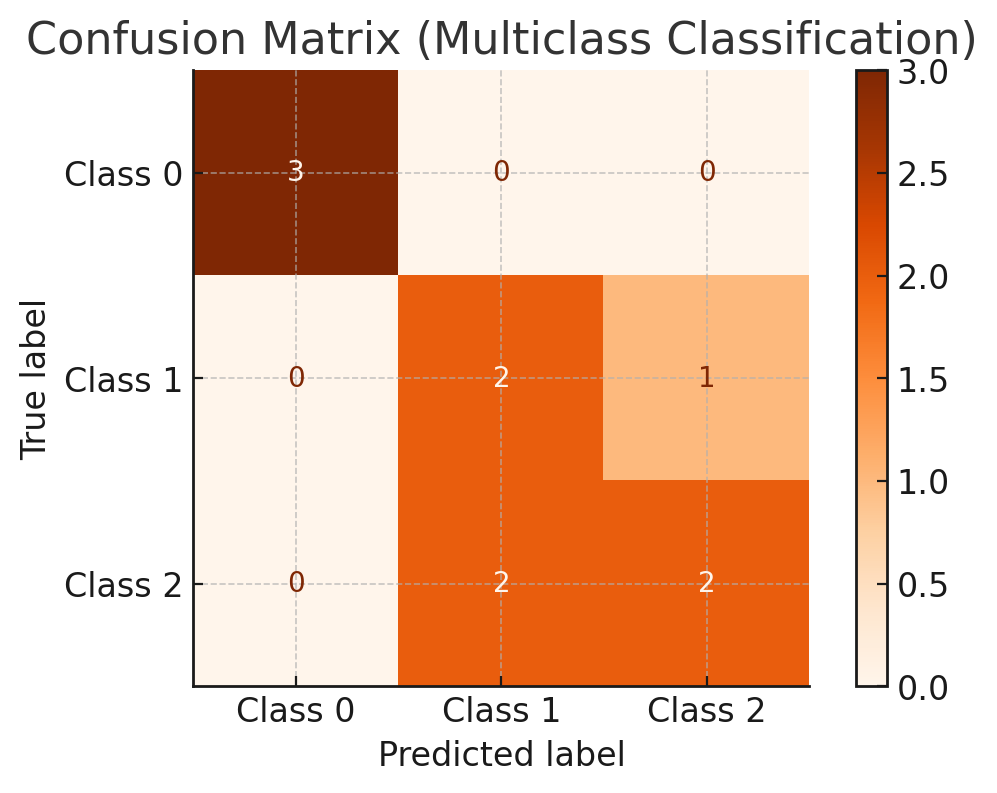
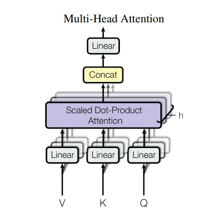
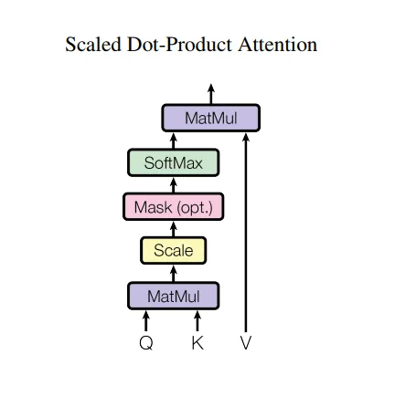

## Deep Learning for Autonomous Trucking


### 1. **Explain the difference between a convolutional neural network (CNN) and a recurrent neural network (RNN). Which one would you prioritize for perception in autonomous trucking? Why?**
**Answer**:
- **CNN**: Used for spatial data like images. Employs convolutional layers to extract features hierarchically.
  
 $$y = f(W \ast x + b)$$
  
  where $\ast$ represents the convolution operation, $W$ is the kernel, $x$ is the input, and $b$ is the bias.

- **RNN**: Designed for sequential data like time-series, using a feedback loop to retain previous information:
  
 $$h_t = f(W_h h_{t-1} + W_x x_t + b)$$

- **Use case in trucking**: CNNs are prioritized for perception tasks like detecting obstacles, lane markings, or traffic signs, as they excel at spatial pattern recognition. RNNs can assist in sequential data tasks like route planning or sensor fusion involving time-dependent inputs.


### 2. **What is sensor fusion? How would you design a fusion algorithm for LIDAR and camera data in a trucking context?**
**Answer**:
Sensor fusion combines data from multiple sensors to achieve better perception accuracy. For LIDAR (depth information) and camera (color/texture), one common method is **Kalman Filtering** or **Deep Learning Fusion**.

- **Steps**:
  - Synchronize timestamps.
  - Project LIDAR data onto the camera image plane using:
    
   $$P_{2D} = K [R | T] P_{3D}$$
   $K$: Camera intrinsic matrix, $R$: Rotation matrix, $T$: Translation vector.
  - Merge features using a neural network:
    - Inputs: RGB image, LIDAR point cloud.
    - Architecture: Two parallel CNN streams, one for each sensor, followed by concatenation and fully connected layers.


### 3. **How would you detect lane departures in real-time using a vision-based system?**
**Answer**:
1. **Preprocessing**:
   - Convert to grayscale and apply edge detection (e.g., Canny).
   - Use perspective transformation to create a bird’s-eye view.
   
2. **Lane Detection**:
   - Use Hough Transform to detect lines:
     
    $$\rho = x \cos \theta + y \sin \theta$$

3. **Departure Logic**:
   - Track the truck's central position relative to detected lanes.
   - If deviation exceeds a threshold:
     
    $$\Delta d > \text{Threshold}$$

     trigger an alert.


### 4. **How do you handle class imbalance in object detection for rare objects like animals on highways?**
**Answer**:
- **Techniques**:
  - **Data augmentation**: Generate synthetic images using GANs.
  - **Oversampling/Undersampling**: Increase rare class samples or downsample frequent ones.
  - **Loss weighting**:
    Modify the loss function to penalize errors on rare classes more:
    
   $$\text{Weighted Loss} = -w_i \cdot y_i \log(\hat{y}_i)$$


### 5. **What challenges arise in real-time inference for object detection, and how do you optimize models for low-latency environments?**
**Answer**:
1. **Challenges**:
   - Limited compute resources onboard.
   - Trade-off between speed and accuracy.

2. **Optimization**:
   - Use smaller models like YOLO or MobileNet.
   - Quantize models to INT8 using TensorRT:
     
    $$\text{Quantized Model} = \text{argmin}_Q ||W - Q(W)||$$
   - Prune unused layers and connections.


### 6. **How would you handle localization drift in a GPS-deprived environment?**
**Answer**:
- Use **Simultaneous Localization and Mapping (SLAM)**:
  - Combine odometry and LIDAR data.
  - Apply graph-based SLAM to correct drift:
    
   $$x^* = \arg \min \sum_{i,j} ||z_{ij} - h(x_i, x_j)||^2$$
    
   $z_{ij}$: Relative motion, $h$: Measurement model.


### 7. **Describe the role of reinforcement learning (RL) in autonomous trucking and its practical challenges.**
**Answer**:
RL is used to optimize driving policies, such as fuel-efficient driving or obstacle avoidance.

- **Algorithm**: Deep Q-Learning:
  
 $$Q(s, a) = r + \gamma \max_{a'} Q(s', a')$$

- **Challenges**:
  - Sparse rewards.
  - Sim-to-real transfer: Policies trained in simulation may not generalize well to real-world trucking scenarios.


### 8. **Explain the significance of Explainable AI (XAI) in autonomous trucking. How would you implement it?**
**Answer**:
- XAI ensures the system's decisions are interpretable, critical for safety and regulatory compliance.
- **Implementation**:
  - Use Grad-CAM for visualizing CNN activations:
    
   $$L_{\text{Grad-CAM}}^c = \text{ReLU}\left( \sum_k w_k^c A^k \right)$$
    
   $A^k$: Activation map, $w_k^c$: Gradients w.r.t. class$c$.


### 9. **Design a collision avoidance system using sensor data.**
**Answer**:
1. Use LIDAR to create a 2D occupancy grid:
   
  $$G(x, y) = \begin{cases} 
   1 & \text{if occupied} \\
   0 & \text{otherwise} 
   \end{cases}
  $$

2. Apply A\* algorithm for path planning:
   - Cost function:
     
    $$f(n) = g(n) + h(n)$$

    $g(n)$: Path cost, $h(n)$: Heuristic.


### 10. **How would you detect tire blowouts using machine learning?**
**Answer**:
- Collect vibration and pressure data.
- Train an anomaly detection model using an Autoencoder:
  
 $$\text{Reconstruction Loss} = ||x - \hat{x}||^2$$


### 11. **What techniques would you use to train a perception model for night driving?**
**Answer**:
- Collect night-driving datasets with varying lighting conditions.
- Use data augmentation (e.g., brightness adjustments).
- Train models with domain adaptation techniques like CycleGAN.


### 12. **How do you deal with overfitting in perception models for autonomous trucks?**
**Answer**:
- Techniques:
  - Regularization ($L_2$):
    
   $$J = J_0 + \lambda ||W||^2$$
    
  - Dropout.


### 13. **How would you validate the safety of an autonomous trucking system in simulation?**
**Answer**:
1. **Scenario Generation**:
   - Simulate edge cases like sudden braking, heavy rain.

2. **Metrics**:
   - Collision rate, mean time to intervention.

3. **Model in-loop Testing**:
   - Integrate the perception model in real-time simulation.


### 14. **Explain how transformers can be used for sequence modeling in truck control systems.**
**Answer**:
- Use a transformer to predict control actions based on past states:
  - Self-attention mechanism:
    
   $$\text{Attention}(Q, K, V) = \text{softmax}\left(\frac{QK^T}{\sqrt{d_k}}\right)V$$
    


### 15. **Describe how you would use federated learning to improve perception models in a fleet of autonomous trucks.**
**Answer**:
- **Steps**:
  1. Train local models on each truck.
  2. Aggregate gradients at a central server:
     
    $$w_t = \frac{1}{n} \sum_{i=1}^n w_t^i$$

  3. Update global model and redistribute.

- **Advantages**:
  - Preserves privacy.
  - Improves model robustness with diverse data.


## General Deep Learning


### 1. **Explain the difference between supervised, unsupervised, and reinforcement learning. Provide mathematical formulations where possible.**

**Answer**:
1. **Supervised Learning**:
   - Goal: Learn a mapping$f: X \to Y$from labeled data$\{(x_i, y_i)\}_{i=1}^N$.
   - Example: Regression, Classification.
   - Loss Function: Minimize error between predicted and true labels.
     
    $\mathcal{L} = \frac{1}{N} \sum_{i=1}^N (y_i - f(x_i))^2$

2. **Unsupervised Learning**:
   - Goal: Find hidden patterns in unlabeled data$\{x_i\}_{i=1}^N$.
   - Example: Clustering, Dimensionality Reduction.
   - Objective (e.g., K-Means):
     
    $\text{Minimize} \sum_{i=1}^N \sum_{j=1}^K ||x_i - \mu_j||^2$

3. **Reinforcement Learning**:
   - Goal: Learn a policy$\pi(a|s)$to maximize cumulative reward$R = \sum_t r_t$.
   - Bellman Equation:
     
    $Q(s, a) = r + \gamma \max_{a'} Q(s', a')$


### 2. **What is overfitting, and how can it be mitigated in machine learning models?**

**Answer**:
- **Overfitting**: A model performs well on training data but poorly on unseen data, typically due to excessive complexity.
- **Mitigation Techniques**:
  1. **Regularization**:
     -$L_1$Regularization:
       
      $\mathcal{L} = \mathcal{L}_{\text{original}} + \lambda ||W||_1$

     -$L_2$Regularization:
       
      $\mathcal{L} = \mathcal{L}_{\text{original}} + \lambda ||W||_2^2$

  2. **Dropout**: Randomly drop neurons during training.
  3. **Cross-Validation**: Validate on subsets of the data.
  4. **Simplify Model**: Reduce model parameters or depth.


### 3. **Explain the difference between bagging and boosting with examples.**

**Answer**:
1. **Bagging**:
   - Technique: Train multiple models independently on bootstrapped datasets.
   - Combines results via averaging or voting.
   - Example: Random Forest.
     
    $\hat{y} = \frac{1}{M} \sum_{m=1}^M f_m(x)$

2. **Boosting**:
   - Technique: Train sequential models, each correcting errors of the previous one.
   - Combines results via weighted voting.
   - Example: AdaBoost.
     
    $F(x) = \text{sign} \left( \sum_{m=1}^M \alpha_m f_m(x) \right)$


### 4. **How does gradient descent work, and what are its limitations?**

**Answer**:
1. **Gradient Descent**:
   - Iteratively updates parameters$\theta$to minimize a loss function:
     
    $\theta := \theta - \eta \nabla_{\theta} \mathcal{L}(\theta)$
    $\eta$: Learning rate.

2. **Limitations**:
   - Convergence to local minima (non-convex loss).
   - Sensitivity to learning rate.
   - Computationally expensive for large datasets.


### 5. **What is the difference between PCA and t-SNE for dimensionality reduction?**

**Answer**:
1. **PCA**:
   - Linear method.
   - Finds directions of maximum variance:
     
    $\text{Maximize: } ||Xw||^2 \text{ subject to } ||w|| = 1$

   - Outputs principal components.

2. **t-SNE**:
   - Non-linear method for visualization.
   - Preserves local structure by minimizing Kullback-Leibler divergence:
     
    $\text{KL}(P||Q) = \sum_{i \neq j} p_{ij} \log \frac{p_{ij}}{q_{ij}}$


### 6. **Explain the backpropagation algorithm used in neural networks.**

**Answer**:
1. **Forward Pass**:
   - Compute predictions:
     
    $\hat{y} = f(x; \theta)$
2. **Backward Pass**:
   - Compute gradients of loss$\mathcal{L}$w.r.t. parameters using the chain rule:
     
    $\frac{\partial \mathcal{L}}{\partial \theta} = \frac{\partial \mathcal{L}}{\partial \hat{y}} \cdot \frac{\partial \hat{y}}{\partial \theta}$


### 7. **How does a convolutional neural network (CNN) work, and why is it effective for image data?**

**Answer**:
- **How it works**:
  - Applies convolution filters to extract spatial features.
  - Pooling layers reduce dimensionality.

- **Effectiveness**:
  - Captures local spatial hierarchies.
  - Reduces parameters compared to fully connected layers.


### 8. **What is transfer learning, and how is it applied?**

**Answer**:
- **Transfer Learning**:
  - Leverages a pre-trained model for a new task.
  - Fine-tune final layers or use the model as a feature extractor.

- Example: Use ImageNet-trained ResNet for medical imaging.


### 9. **How does a recurrent neural network (RNN) handle sequential data?**

**Answer**:
- **RNN Equation**:
  
 $h_t = f(W_h h_{t-1} + W_x x_t + b)$
- Keeps memory through hidden states, making it effective for time-series and natural language processing.


### 10. **What is a GAN, and how does it work?**

**Answer**:
1. **GAN**:
   - Generates synthetic data.
   - Comprises two networks:
     1. Generator $G(z)$
     2. Discriminator $D(x)$

2. **Objective**:
   - Minimax optimization:
     
    $\min_G \max_D \mathbb{E}[\log D(x)] + \mathbb{E}[\log(1 - D(G(z)))]$


### 11. **What is the difference between L1 and L2 regularization?**

**Answer**:
1. **L1 Regularization**:
   - Adds$||W||_1$to loss:
     
    $\mathcal{L} = \mathcal{L}_{\text{original}} + \lambda ||W||_1$
   - Encourages sparsity.

2. **L2 Regularization**:
   - Adds$||W||_2^2$:
     
    $\mathcal{L} = \mathcal{L}_{\text{original}} + \lambda ||W||_2^2$
   - Prevents overfitting by penalizing large weights.


### 12. **How would you evaluate the performance of a classification model?**

**Answer**:
1. **Metrics**:
   - Accuracy, Precision, Recall, F1-Score.
   - ROC-AUC for imbalance.
2. **Confusion Matrix**:

    
    


### 13. **Explain attention mechanisms in transformers.**

**Answer**:
- Compute relevance of input tokens:
  
 $\text{Attention}(Q, K, V) = \text{softmax}\left(\frac{QK^T}{\sqrt{d_k}}\right)V$


### 14. **How would you handle missing data in a dataset?**

**Answer**:
1. **Imputation**:
   - Mean/Median for numerical.
   - Mode for categorical.
2. **Model-Based**:
   - Predict missing values using regression.


### 15. **What is the difference between batch, mini-batch, and stochastic gradient descent?**

**Answer**:
1. **Batch Gradient Descent**:
   - Uses all data:
     
    $\theta := \theta - \eta \nabla_{\theta} \mathcal{L}$
2. **Stochastic**:
   - Single sample.
3. **Mini-Batch**:
   - Subsets of data.


## Transformer and Vision Transformer

[Transformer](https://medium.com/@corymaklin/transformers-explained-610b2f749f43)





[ViT: Vision Transformer](https://python.plainenglish.io/visual-transformer-vit-4eaa90fb936b)


### 1. **What is a transformer, and how does it differ from traditional neural network architectures like CNNs and RNNs?**

**Answer**:
- **Transformer**:
  - A deep learning model designed for sequence-to-sequence tasks.
  - Based on attention mechanisms instead of recurrent connections (RNN) or convolutional layers (CNN).

- **Key Differences**:
  1. **Attention**:
     
    $\text{Attention}(Q, K, V) = \text{softmax}\left(\frac{QK^T}{\sqrt{d_k}}\right)V$

     -$Q, K, V$: Query, Key, and Value matrices.
  2. **Parallelism**: Transformers process all tokens simultaneously, unlike RNNs which process sequentially.
  3. **Scalability**: Transformers handle larger models and datasets efficiently.


### 2. **What are Vision Transformers (ViTs), and why are they significant in computer vision?**

**Answer**:
- **Vision Transformer (ViT)**:
  - Adapts transformers to image data by splitting images into patches.
  - Each patch is treated as a token, and positional embeddings are added.

- **Significance**:
  - Handles long-range dependencies better than CNNs.
  - Performance scales with data.

- **Architecture**:
  - Input:$x \in \mathbb{R}^{H \times W \times C}$→ Split into patches$P$.
  - Linear projection for patches:
    
    $z_0 = [x_1E; x_2E; \dots; x_NE] + E_{\text{pos}}$


### 3. **How do Vision Transformers handle spatial information in images?**

**Answer**:
- **Patch Embedding**: Images are divided into fixed-size patches.
- **Positional Embedding**: Injects location-specific information:
  
 $z_i = x_iE + E_{\text{pos}}^i$

- **Self-Attention**: Aggregates spatial relationships across patches:
  
 $\text{Attention}(Q, K, V) = \text{softmax}\left(\frac{QK^T}{\sqrt{d_k}}\right)V$


### 4. **What are the main computational challenges of Vision Transformers, and how are they addressed?**

**Answer**:
1. **High Memory Usage**:
   - Self-attention scales quadratically:$O(N^2d_k)$.
   - Solution: Use **hierarchical transformers** or **sparse attention**.

2. **Data Requirements**:
   - ViTs require large datasets to generalize.
   - Solution: Pretrain on large datasets and fine-tune.


### 5. **Compare Vision Transformers with CNNs in terms of performance and use cases.**

**Answer**:
- **ViTs**:
  - Strengths: Global attention, better at long-range dependencies.
  - Weakness: Requires more data for effective training.

- **CNNs**:
  - Strengths: Efficient for small datasets, inductive bias for spatial locality.
  - Weakness: Limited ability to model global relationships.


### 6. **How is positional encoding implemented in Vision Transformers?**

**Answer**:
- Positional Encoding adds spatial information to the patches.
- Implementation:
  - Learnable embeddings$E_{\text{pos}}$.
  - Sinusoidal functions:
    
   $PE_{(pos, 2i)} = \sin\left(\frac{pos}{10000^{2i/d}}\right), \quad PE_{(pos, 2i+1)} = \cos\left(\frac{pos}{10000^{2i/d}}\right)$


### 7. **What is the role of multi-head attention in Vision Transformers?**

**Answer**:
- **Multi-Head Attention**:
  - Allows the model to learn different aspects of attention.
  - Formula:
    
   $\text{MultiHead}(Q, K, V) = \text{Concat}(\text{head}_1, \text{head}_2, \dots, \text{head}_h)W^O$
    where:
    
   $\text{head}_i = \text{Attention}(QW_i^Q, KW_i^K, VW_i^V)$


### 8. **Explain the training process for Vision Transformers.**

**Answer**:
1. **Preprocessing**:
   - Split the image into patches, create embeddings.
2. **Loss Function**:
   - Cross-entropy for classification:
     
    $\mathcal{L} = -\frac{1}{N} \sum_{i=1}^N y_i \log(\hat{y}_i)$

3. **Optimization**:
   - Use AdamW optimizer with learning rate warmup.


### 9. **What is the significance of hierarchical Vision Transformers?**

**Answer**:
- **Hierarchical ViTs**:
  - Reduce computational complexity by merging patches progressively.
  - Mimics CNNs' feature hierarchy.
  - Example: Swin Transformer uses windowed attention.


### 10. **What are some real-world applications of Vision Transformers?**

**Answer**:
1. **Medical Imaging**: Analyze high-resolution scans.
2. **Autonomous Vehicles**: Process spatial relationships in road scenes.
3. **Remote Sensing**: Detect objects in satellite images.


## RNN: Recurrent Neural Networks


### 1. **What are Recurrent Neural Networks (RNNs), and how are they different from traditional feedforward networks?**

**Answer**:
- **RNNs**:
  - Designed for sequential data by maintaining hidden states$h_t$.
  - Captures temporal dependencies:
    
   $h_t = f(W_h h_{t-1} + W_x x_t + b)$

  - Output:
    
   $y_t = g(W_y h_t + b_y)$


- **Difference**:
  - Traditional feedforward networks process inputs independently.
  - RNNs use past information to influence current outputs.


### 2. **Explain the vanishing gradient problem in RNNs and how it affects training.**

**Answer**:
- **Vanishing Gradient**:
  - Gradients shrink exponentially during backpropagation:
    
   $\frac{\partial \mathcal{L}}{\partial W} \propto \prod_{t=1}^T \frac{\partial h_t}{\partial h_{t-1}}$

  - Small derivatives cause information loss over long sequences.

- **Impact**:
  - Difficulty in learning long-term dependencies.


### 3. **How do Long Short-Term Memory (LSTM) networks address the vanishing gradient problem?**


**Answer**:
- **LSTM**:
  - Introduces memory cells with gates to control information flow:
    - Forget Gate:
      
     $f_t = \sigma(W_f [h_{t-1}, x_t] + b_f)$

    - Input Gate:
      
     $i_t = \sigma(W_i [h_{t-1}, x_t] + b_i)$

    - Output Gate:
      
     $o_t = \sigma(W_o [h_{t-1}, x_t] + b_o)$


- **Effect**:
  - Maintains long-term dependencies by mitigating gradient vanishing.


### 4. **What are Gated Recurrent Units (GRUs), and how do they compare to LSTMs?**

**Answer**:
- **GRUs**:
  - A simplified version of LSTMs with fewer parameters.
  - Combines input and forget gates into an update gate:
    
   $z_t = \sigma(W_z [h_{t-1}, x_t] + b_z)$

  - Reset gate:
    
   $r_t = \sigma(W_r [h_{t-1}, x_t] + b_r)$


- **Comparison**:
  - GRUs are computationally faster due to fewer parameters.
  - LSTMs may capture more complex dependencies.


### 5. **What is the significance of bidirectional RNNs in sequence modeling?**

**Answer**:
- **Bidirectional RNNs**:
  - Process sequences in both forward and backward directions:
    
   $h_t^{\text{forward}} = f(W_h h_{t-1}^{\text{forward}} + W_x x_t + b)$

    
   $h_t^{\text{backward}} = f(W_h h_{t+1}^{\text{backward}} + W_x x_t + b)$


- **Use Cases**:
  - Improves accuracy in applications where future context matters (e.g., speech recognition).


### 6. **How would you implement an RNN for time-series prediction?**

**Answer**:
1. **Architecture**:
   - Input: Sequence$\{x_1, x_2, \dots, x_T\}$.
   - Output: Predicted sequence$\{\hat{y}_1, \hat{y}_2, \dots, \hat{y}_T\}$.

2. **Training**:
   - Minimize mean squared error:
     
    $\mathcal{L} = \frac{1}{T} \sum_{t=1}^T (y_t - \hat{y}_t)^2$


3. **Optimization**:
   - Use Adam optimizer with gradient clipping.


### 7. **What is teacher forcing in RNNs, and why is it used?**

**Answer**:
- **Teacher Forcing**:
  - During training, the ground truth is used as input for the next time step instead of the model's prediction.

- **Purpose**:
  - Accelerates convergence.
  - Reduces exposure bias (model learning errors from its predictions).


### 8. **Explain attention mechanisms in the context of RNNs.**

**Answer**:
- **Attention**:
  - Focuses on specific parts of the input sequence when generating outputs.
  - Weighting mechanism:
    
   $\alpha_t = \frac{\exp(e_t)}{\sum_{k=1}^T \exp(e_k)}$

    where:
    
   $e_t = a(h_t, s_{t-1})$


- **Application**:
  - Improves performance in tasks like machine translation.


### 9. **How do RNNs differ from Transformers in handling sequential data?**

**Answer**:
1. **RNNs**:
   - Process sequentially, maintaining a hidden state.
   - Computationally expensive for long sequences.

2. **Transformers**:
   - Use self-attention to process all tokens in parallel.
   - Better scalability and performance on long sequences.


### 10. **What are the limitations of RNNs, and how are they addressed in modern architectures?**

**Answer**:
- **Limitations**:
  1. Vanishing gradient.
  2. Slow training.
  3. Poor scalability.

- **Solutions**:
  1. Use LSTMs/GRUs.
  2. Replace with Transformer-based architectures.


## CNN: Convolutional Neural Networks


### 1. **What is a Convolutional Neural Network (CNN), and why is it effective for image data?**

**Answer**:
- **Definition**: CNNs are neural networks designed for processing spatial data like images by leveraging convolutions to extract spatial hierarchies.
- **Effectiveness**:
  - Extracts features such as edges, textures, and shapes hierarchically.
  - Reduces parameters compared to fully connected networks.

- **Core Operation**:
  $y_{i,j} = \sum_{m=-k}^{k} \sum_{n=-k}^{k} W[m, n] \cdot x[i+m, j+n] + b$

  $W$: Kernel, $x$: Input patch, $b$: Bias.


### 2. **Explain the role of pooling layers in CNNs. What are the types of pooling?**

**Answer**:
- **Purpose**:
  - Downsample feature maps.
  - Reduce computational load.
  - Improve spatial invariance.

- **Types**:
  - **Max Pooling**:
    
    $y_{i,j} = \max_{m,n \in \text{window}} x[m,n]$

  - **Average Pooling**:
    
    $y_{i,j} = \frac{1}{\text{window size}} \sum_{m,n \in \text{window}} x[m,n]$


### 3. **What is a receptive field in CNNs, and why is it important?**

**Answer**:
- **Receptive Field**:
  - The region of the input image a neuron in the feature map is sensitive to.
  - Grows with deeper layers.

- **Importance**:
  - Larger receptive fields capture global context.
  - Small receptive fields capture fine details.


### 4. **What are dilated convolutions, and when are they useful?**

**Answer**:
- **Definition**:
  - Convolutions with gaps between kernel elements, controlled by the dilation rate $d$:
    
    $y[i,j] = \sum_{m=-k}^{k} \sum_{n=-k}^{k} W[m, n] \cdot x[i+md, j+nd]$


- **Usefulness**:
  - Expands receptive field without increasing parameters.
  - Effective in tasks like segmentation.


### 5. **How does batch normalization work in CNNs, and why is it important?**

**Answer**:
- **Batch Normalization**:
  - Normalizes activations to have zero mean and unit variance:
    
    $\hat{x} = \frac{x - \mu}{\sqrt{\sigma^2 + \epsilon}}$

  - Applies learnable parameters $\gamma$and $\beta$:
    
    $y = \gamma \hat{x} + \beta$


- **Importance**:
  - Accelerates convergence.
  - Reduces sensitivity to initialization.
  - Acts as a regularizer.


### 6. **Explain how CNNs perform image classification.**

**Answer**:
1. **Convolutional Layers**: Extract features from images.
2. **Pooling Layers**: Downsample feature maps.
3. **Fully Connected Layers**:
   - Map features to class probabilities:
     $y = \text{softmax}(Wx + b)$

4. **Loss Function**:
   - Cross-entropy:
     $\mathcal{L} = -\sum_{c} y_c \log(\hat{y}_c)$


### 7. **What is transfer learning in the context of CNNs, and how is it applied?**

**Answer**:
- **Transfer Learning**:
  - Use a pre-trained CNN for a different task.
  - Freeze early layers and fine-tune the final layers.

- **Application**:
  - Use ResNet pre-trained on ImageNet for medical image classification.


### 8. **How does a CNN handle varying image sizes?**

**Answer**:
- **Methods**:
  - Resize images to a fixed size.
  - Use global pooling layers instead of fully connected layers to aggregate features.


### 9. **What is the vanishing gradient problem in deep CNNs, and how is it addressed?**

**Answer**:
- **Vanishing Gradient**:
  - Gradients diminish in deep networks, slowing training.

- **Solutions**:
  - Use residual connections (ResNets):
    
    $y = f(x) + x$


### 10. **Explain the architecture and advantages of ResNet.**

**Answer**:
- **Architecture**:
  - Incorporates residual blocks with skip connections:
    
    $y = f(x, W) + x$


- **Advantages**:
  - Enables training of very deep networks.
  - Mitigates vanishing gradients.


## General Computer Vision


### 1. **What is image segmentation, and how does it differ from object detection and classification?**

**Answer**:
- **Image Segmentation**:
  - Divides an image into multiple regions or objects by assigning a label to each pixel.
  - Types:
    1. **Semantic Segmentation**: Groups all pixels of the same class together.
    2. **Instance Segmentation**: Distinguishes between different objects of the same class.

- **Differences**:
  - **Classification**: Assigns a single label to the entire image.
  - **Object Detection**: Draws bounding boxes around objects.


### 2. **Explain the architecture of U-Net and why it is popular for segmentation tasks.**

**Answer**:
- **U-Net**:
  - A CNN architecture with an encoder-decoder structure and skip connections.
  - **Encoder**: Extracts features through convolutions and pooling.
  - **Decoder**: Upsamples features to reconstruct spatial dimensions.

- **Skip Connections**:
  - Help retain spatial information:
    
    $\text{Output at each decoder step} = \text{Upsampled output} + \text{Features from encoder layer}$


- **Popularity**:
  - Effective for medical imaging due to precise localization.


### 3. **What is the Intersection over Union (IoU) metric, and how is it used in segmentation?**

**Answer**:
- **IoU**:
  - Measures overlap between predicted and ground truth masks:
    
    $\text{IoU} = \frac{\text{Area of Overlap}}{\text{Area of Union}}$


- **Usage**:
  - Evaluates segmentation accuracy.
  - A high IoU indicates better model performance.


### 4. **What are fully convolutional networks (FCNs), and how do they perform segmentation?**

**Answer**:
- **FCNs**:
  - Replace fully connected layers with convolutional layers.
  - Use upsampling layers (e.g., transposed convolution) to restore spatial dimensions.

- **Segmentation Workflow**:
  - Extract features → Downsample → Upsample for pixel-level predictions.


### 5. **Explain how conditional random fields (CRFs) are used to refine segmentation results.**

**Answer**:
- **CRFs**:
  - Probabilistic models that enforce spatial coherence.
  - Refine segmentation by smoothing predictions while preserving edges.

- **Energy Function**:
  $E(x) = \sum_i \psi_u(x_i) + \sum_{i,j} \psi_p(x_i, x_j)$

  - Unary term $\psi_u$: Pixel-level predictions.
  - Pairwise term $\psi_p$: Enforces smoothness.


### 6. **What are attention mechanisms in segmentation, and how do they improve performance?**

**Answer**:
- **Attention Mechanisms**:
  - Focus on important regions in the feature map.
  - Example: Self-attention in Transformer-based models.

- **Benefits**:
  - Enhances performance by capturing global dependencies.

- **Formula**:
  $\text{Attention}(Q, K, V) = \text{softmax}\left(\frac{QK^T}{\sqrt{d_k}}\right)V$


### 7. **How does DeepLab improve segmentation using dilated convolutions?**

**Answer**:
- **DeepLab**:
  - Uses dilated (atrous) convolutions to enlarge the receptive field without increasing parameters.

- **Advantages**:
  - Captures multi-scale context.
  - Reduces loss of spatial resolution.


### 8. **What is the role of multi-scale feature fusion in segmentation?**

**Answer**:
- **Multi-Scale Feature Fusion**:
  - Combines features from different layers to capture both global and local context.
  - Examples:
    - Feature Pyramid Networks (FPN).
    - PSPNet (Pyramid Scene Parsing Network).


### 9. **Explain how instance segmentation differs from semantic segmentation and the challenges involved.**

**Answer**:
- **Instance Segmentation**:
  - Distinguishes between individual objects within the same class.
  - Example: Mask R-CNN.

- **Challenges**:
  - Requires precise object boundaries.
  - Higher computational complexity than semantic segmentation.


### 10. **How do Transformer-based models like SegFormer perform segmentation?**

**Answer**:
- **SegFormer**:
  - Uses hierarchical Transformers to capture multi-scale features.
  - Combines global context from attention mechanisms with spatial details.

- **Advantages**:
  - Scalable and efficient.
  - Outperforms traditional CNN-based models in accuracy.


## SAM: Segment Anything Model
[SAM Paper](https://arxiv.org/pdf/2304.02643)

[SAM2 Paper](https://arxiv.org/pdf/2408.00714)


### 1. **What is the Segment Anything Model (SAM), and what are its key features?**

**Answer**:
- **Definition**: SAM is a vision model designed to perform segmentation on any object in an image, even without task-specific training.
- **Key Features**:
  - **Zero-shot capability**: No fine-tuning required for new tasks.
  - **Prompt-based segmentation**: Accepts text, bounding box, or points as prompts to segment objects.
  - **Scalability**: Trained on diverse datasets for generalization.


### 2. **What is the architecture of SAM, and how does it perform segmentation?**

**Answer**:
- **Architecture**:
  1. **Image Encoder**:
     - Processes the input image into a feature map.
     - Typically a Vision Transformer (ViT).
  2. **Prompt Encoder**:
     - Encodes input prompts like points or bounding boxes into an embedding.
  3. **Mask Decoder**:
     - Combines image and prompt embeddings to generate segmentation masks.

- **Process**:
  - Input → Encode features and prompts → Decode segmentation mask.


### 3. **How does the prompt-based segmentation in SAM work?**

**Answer**:
- Prompts (e.g., a point, text, or bounding box) guide the model to focus on specific regions.
- **Mechanism**:
  - The prompt is embedded and concatenated with the image feature map.
  - Decoder processes the combined embeddings to generate the corresponding mask.


### 4. **Explain SAM’s training process.**

**Answer**:
- **Dataset**:
  - Trained on a massive dataset with diverse objects and segmentation annotations.
- **Objective**:
  - Minimize a segmentation loss:
    
    $\mathcal{L} = \mathcal{L}_{\text{cross-entropy}} + \lambda \mathcal{L}_{\text{dice}}$

    - Cross-entropy loss: Pixel-wise classification.
    - Dice loss: Measures overlap between predicted and ground truth masks.


### 5. **What are the advantages of SAM over traditional segmentation models?**

**Answer**:
1. **Generalization**:
   - Works on diverse datasets and tasks without fine-tuning.
2. **Prompt Flexibility**:
   - Adapts to different types of inputs (e.g., points, text).
3. **Zero-shot Segmentation**:
   - No task-specific retraining required.


### 6. **What are the computational challenges of SAM, and how can they be mitigated?**

**Answer**:
1. **High Computational Cost**:
   - Vision Transformer encoders are resource-intensive.
   - **Solution**: Use efficient ViT variants or reduce image resolution.
2. **Latency**:
   - Processing large images with multiple prompts can be slow.
   - **Solution**: Implement parallel processing for prompts.


### 7. **How does SAM handle ambiguous segmentation tasks, such as overlapping objects?**

**Answer**:
- SAM uses multiple prompts to resolve ambiguities.
- **Example**:
  - For overlapping objects, distinct points or bounding boxes can guide the model to produce separate masks.


### 8. **What are the limitations of SAM, and how can they impact its use in real-world applications?**

**Answer**:
- **Limitations**:
  1. Performance degrades on unseen, highly specific datasets (e.g., medical imaging).
  2. Cannot generate masks without meaningful prompts.
  3. High computational requirements.

- **Impact**:
  - May require task-specific fine-tuning or dataset augmentation.


### 9. **How does SAM compare to Mask R-CNN for instance segmentation?**

**Answer**:
- **SAM**:
  - General-purpose.
  - Requires prompts for segmentation.
  - Better for zero-shot tasks.
- **Mask R-CNN**:
  - Task-specific and fine-tuned for datasets.
  - Requires retraining for new tasks.


### 10. **What are potential applications of SAM in real-world scenarios?**

**Answer**:
1. **Medical Imaging**: Segment organs or lesions with minimal labeling.
2. **Autonomous Vehicles**: Identify objects on the road using point prompts.
3. **Content Creation**: Extract objects for design or editing.
4. **Robotics**: Segment objects for manipulation tasks.


## SAMURAI: SAM-based Unified and Robust zero-shot visual tracker with motion-Aware Instance-level memory.

[Paper](https://arxiv.org/pdf/2411.11922)


### 1. **What is the Samurai Model, and how does it differ from traditional segmentation models like SAM?**

**Answer**:
- **Samurai Model**:
  - A next-gen segmentation framework focusing on context-aware, multi-object segmentation in dynamic scenes.
  - Incorporates spatio-temporal reasoning to segment objects that move or interact over time.

- **Key Differences**:
  - Adds a temporal dimension for dynamic environments.
  - Uses attention mechanisms tailored to sequential image frames.


### 2. **Explain the architecture of the Samurai Model.**

**Answer**:
- **Key Components**:
  1. **Temporal Encoder**:
     - Processes sequences of frames to capture motion and context.
     - Uses Temporal Convolution or 3D ConvNets.
  2. **Contextual Decoder**:
     - Enhances segmentation by integrating spatial and temporal features.
     - Uses Transformer-based attention for global dependencies.

- **Workflow**:
  - Sequence Input → Temporal Encoder → Feature Fusion → Decoder → Segmentation Masks.


### 3. **How does the Samurai Model handle occlusions in dynamic scenes?**

**Answer**:
- Incorporates attention-based mechanisms to weigh contributions from past and current frames.
- Uses temporal consistency checks:
  $\mathcal{C}(p_t, p_{t-1}) = \|p_t - \text{warp}(p_{t-1})\|$

  $\text{warp}$: Motion compensation operator.


### 4. **What loss functions are commonly used to train the Samurai Model?**

**Answer**:
1. **Pixel-wise Loss**:
   - Cross-entropy:
     $\mathcal{L}_{\text{pixel}} = -\sum_i y_i \log(\hat{y}_i)$
2. **Temporal Consistency Loss**:
   - Encourages consistency across frames:
     $\mathcal{L}_{\text{temp}} = \sum_t \|M_t - \text{warp}(M_{t-1})\|_2$
3. **Edge-Aware Loss**:
   - Penalizes mask errors along object boundaries.


### 5. **How does the Samurai Model handle segmentation in low-light or noisy environments?**

**Answer**:
- Uses pre-trained encoders sensitive to low-light features.
- Temporal averaging across frames reduces noise:
  $M_t^{\text{denoised}} = \frac{1}{N} \sum_{k=t-N}^{t} M_k$


### 6. **What datasets are suitable for training the Samurai Model?**

**Answer**:
- **Dynamic Scene Datasets**:
  1. Cityscapes-VID: Urban driving with moving objects.
  2. DAVIS: Object tracking in video.
  3. MOTS (Multi-Object Tracking and Segmentation): Segmentation in crowded environments.


### 7. **What are the computational challenges of the Samurai Model, and how are they addressed?**

**Answer**:
- **Challenges**:
  - High memory requirements due to spatio-temporal processing.
  - Latency issues during inference.

- **Solutions**:
  - **Memory Efficiency**: Use sparse attention mechanisms.
  - **Latency Reduction**: Optimize temporal encoder with lightweight networks.


### 8. **How does the Samurai Model achieve multi-scale segmentation?**

**Answer**:
- Integrates multi-scale feature maps from the encoder:
  $F = \text{Concat}(F_{\text{low}}, F_{\text{mid}}, F_{\text{high}})$

- Attention layers prioritize relevant features at different scales.


### 9. **Compare the Samurai Model with SAM for video-based segmentation.**

**Answer**:
- **Samurai Model**:
  - Designed for dynamic, temporal segmentation.
  - Stronger performance on video data with occlusions and interactions.
- **SAM**:
  - General-purpose segmentation.
  - Lacks temporal reasoning.


### 10. **What are real-world applications of the Samurai Model?**

**Answer**:
1. **Autonomous Driving**: Segment dynamic objects in traffic scenes.
2. **Sports Analytics**: Track and segment players in fast-paced games.
3. **Surveillance**: Monitor and segment moving objects in security footage.
4. **Robotics**: Identify and interact with moving objects.


## R-CNN vs. SAM


### 1. **What is RCNN, and how does it perform object detection and segmentation?**

**Answer**:
- **RCNN (Regions with Convolutional Neural Networks)**:
  - A two-stage object detection method:
    1. Generates region proposals using methods like Selective Search.
    2. Classifies proposals using a CNN and refines bounding boxes.

- **Process**:
  - Extract region proposals → Feature extraction with CNN → Classification and bounding box regression.


### 2. **What is the Segment Anything Model (SAM), and how does it differ from RCNN?**

**Answer**:
- **SAM**:
  - A general-purpose segmentation model that segments objects based on prompts (e.g., text, points, or bounding boxes).
  - Unlike RCNN, SAM doesn't require training for a specific dataset.

- **Key Differences**:
  - RCNN focuses on detection and segmentation for specific tasks.
  - SAM provides zero-shot segmentation on unseen tasks.


### 3. **Compare RCNN and SAM in terms of architecture and workflow.**

**Answer**:
- **RCNN**:
  - **Architecture**: Region proposal network (RPN) + CNN + Fully connected layers.
  - **Workflow**: Region proposals → CNN → Object detection and segmentation.

- **SAM**:
  - **Architecture**: Vision Transformer + Prompt Encoder + Mask Decoder.
  - **Workflow**: Image and prompts → Feature encoding → Mask prediction.


### 4. **How do RCNN and SAM handle computational efficiency?**

**Answer**:
- **RCNN**:
  - Inefficient due to repeated CNN computations for each region proposal.
  - Faster R-CNN improves this by sharing features across proposals.

- **SAM**:
  - Computationally intensive due to ViT encoders.
  - Optimizations like efficient ViTs can improve runtime.


### 5. **Which model is better suited for real-time applications, RCNN or SAM?**

**Answer**:
- **RCNN**:
  - Standard RCNN is slow; Faster R-CNN or YOLO is preferred for real-time detection.

- **SAM**:
  - Not optimized for real-time applications due to high computational demands.

- **Verdict**:
  - Use RCNN variants for real-time detection and SAM for complex segmentation tasks requiring zero-shot capabilities.


### 6. **How do RCNN and SAM handle multi-object scenarios?**

**Answer**:
- **RCNN**:
  - Generates multiple region proposals and processes each independently.
  - Struggles with overlapping objects due to fixed bounding boxes.

- **SAM**:
  - Uses prompts to segment each object, handling overlaps more flexibly.


### 7. **What datasets are typically used for RCNN and SAM training or evaluation?**

**Answer**:
- **RCNN**:
  - COCO: Object detection and segmentation.
  - PASCAL VOC: Object detection tasks.

- **SAM**:
  - Diverse datasets including COCO, ADE20K, and ImageNet for robust generalization.


### 8. **What are the advantages of SAM over RCNN for segmentation tasks?**

**Answer**:
1. **Zero-shot Segmentation**:
   - SAM generalizes to new tasks without retraining.
2. **Prompt Flexibility**:
   - Supports text, points, and bounding boxes as prompts.
3. **Global Context**:
   - Vision Transformers capture global relationships.


### 9. **What are the advantages of RCNN over SAM for object detection?**

**Answer**:
1. **Task-Specific Optimization**:
   - RCNN is fine-tuned for specific datasets and tasks.
2. **Lower Computational Requirements**:
   - Faster R-CNN and other variants are less resource-intensive compared to SAM.


### 10. **In which scenarios would you choose SAM over RCNN and vice versa?**

**Answer**:
- **Choose SAM**:
  - When generalization is needed across diverse tasks.
  - For segmentation tasks where no fine-tuning is feasible.

- **Choose RCNN**:
  - For object detection tasks with predefined classes.
  - In real-time applications where efficiency is critical (using Faster R-CNN).


## Object Detection


### 1. **What is object detection, and how does it differ from classification and segmentation?**

**Answer**:
- **Object Detection**:
  - Identifies and localizes objects in an image using bounding boxes and class labels.

- **Differences**:
  - **Classification**: Assigns a single label to an entire image.
  - **Segmentation**: Provides pixel-level labels, while object detection focuses on bounding boxes.


### 2. **What are the main components of an object detection pipeline?**

**Answer**:
1. **Feature Extraction**:
   - Uses CNNs or Transformers to extract meaningful features.
2. **Region Proposal**:
   - Generates candidate object regions (e.g., RPN in Faster R-CNN).
3. **Classification and Localization**:
   - Assigns class labels and refines bounding box coordinates.


### 3. **Compare one-stage and two-stage object detection methods.**

**Answer**:
- **One-Stage**:
  - Directly predicts bounding boxes and class labels (e.g., YOLO, SSD).
  - Faster but less accurate.
  
- **Two-Stage**:
  - First stage: Region proposal (e.g., RPN).
  - Second stage: Classification and localization (e.g., Faster R-CNN).
  - Slower but more accurate.


### 4. **Explain the YOLO architecture and why it is popular.**

**Answer**:
- **YOLO (You Only Look Once)**:
  - Divides an image into a grid and predicts bounding boxes and class probabilities for each cell.
  - Uses a single convolutional network for both detection and classification.

- **Advantages**:
  - Real-time performance.
  - Simplicity in training and deployment.


### 5. **What is the role of anchor boxes in object detection models like Faster R-CNN?**

**Answer**:
- **Anchor Boxes**:
  - Predefined bounding boxes of various sizes and aspect ratios.
  - Serve as reference points for detecting objects of different scales.

- **Mechanism**:
  - Model predicts offsets relative to anchor boxes.


### 6. **What are non-maximum suppression (NMS) and its significance in object detection?**

**Answer**:
- **NMS**:
  - Removes redundant bounding boxes with high overlap.
  - Retains the box with the highest confidence score.

- **Algorithm**:
  - Calculate IoU:
    
    $\text{IoU} = \frac{\text{Intersection Area}}{\text{Union Area}}$

  - Discard boxes with IoU above a threshold.


### 7. **Explain the Faster R-CNN architecture.**

**Answer**:
- **Faster R-CNN**:
  - Combines feature extraction, region proposal, and detection in a single framework.
  1. **Feature Extractor**: Backbone CNN (e.g., ResNet).
  2. **RPN (Region Proposal Network)**:
     - Proposes candidate regions.
  3. **ROI Pooling**:
     - Extracts fixed-size features for each proposal.
  4. **Classifier and Regressor**:
     - Assigns class labels and refines bounding boxes.


### 8. **What is focal loss, and why is it used in object detection?**

**Answer**:
- **Focal Loss**:
  - Addresses class imbalance in dense detectors like RetinaNet.
  - Reduces loss contribution from easy negatives:
    
    $\mathcal{L}_{\text{focal}} = -\alpha (1 - p_t)^\gamma \log(p_t)$

    - $\alpha$: Balancing factor.
    - $\gamma$: Modulates focus on hard examples.


### 9. **What are the challenges of multi-scale object detection, and how are they addressed?**

**Answer**:
- **Challenges**:
  - Detecting objects of varying sizes and aspect ratios.

- **Solutions**:
  1. **Feature Pyramid Networks (FPN)**:
     - Combines features from different layers.
  2. **Anchor Boxes**:
     - Use multiple scales and aspect ratios.


### 10. **What metrics are used to evaluate object detection models?**

**Answer**:
- **Metrics**:
  1. **Precision and Recall**:
     - Precision: Correct predictions out of total predictions.
     - Recall: Correct predictions out of ground truths.
  2. **Mean Average Precision (mAP)**:
     - Average precision over multiple IoU thresholds:
       $\text{AP} = \int_0^1 p(r) dr$


## YOLO and YOLO-11

[YOLO](https://arxiv.org/pdf/1506.02640)

[YOLOv11](https://arxiv.org/pdf/2410.17725)

### **Steps in YOLO Architecture**

1. **Input Image Processing**:
   - The input image is resized to a fixed dimension (e.g., 416x416).
   - The image is divided into an $S \times S$grid (e.g., $13 \times 13$).

2. **Grid Prediction**:
   - Each grid cell predicts:
     - $B$bounding boxes (e.g., $B = 5$).
     - Confidence score for each bounding box ($C_i$):
       $C_i = \text{Pr(Object)} \times \text{IoU}_{\text{truth, pred}}$
     - Class probabilities ($P(c|Object)$).

3. **Bounding Box Representation**:
   - Each bounding box is parameterized by:
     $(x, y, w, h, C)$
     - $x, y$: Center of the box relative to the grid cell.
     - $w, h$: Width and height relative to the entire image.
     - $C$: Confidence score.

4. **Output Tensor**:
   - The output is a tensor of size:
     $S \times S \times (B \times 5 + C)$
     - $B$: Number of bounding boxes per grid cell.
     - $C$: Number of object classes.

5. **Non-Maximum Suppression (NMS)**:
   - Removes redundant boxes with high overlap based on Intersection over Union (IoU).


### **Advantages of YOLO**
1. **Speed**: Real-time performance due to its one-stage design.
2. **End-to-End**: Combines feature extraction, classification, and localization into a single network.
3. **Global Context**: Analyzes the entire image at once, reducing background errors.


### **Limitations of YOLO**
1. Struggles with small objects in dense scenes due to coarse grid size.
2. Limited localization accuracy for overlapping objects.


### **How YOLO-11 Differs from YOLO**

YOLO-11 is a hypothetical advanced version that builds on the core principles of YOLO but introduces enhancements to overcome its limitations.


### **Key Differences**

#
### 1. **Advanced Backbone Network**:
- **YOLO**: Typically uses backbones like `DarkNet-19` or `DarkNet-53`.
- **YOLO-11**:
  - Employs a `Vision Transformer (ViT)` or a `Swin Transformer` backbone.
  - Captures global context better with self-attention mechanisms.

#
### 2. **Multi-Scale Predictions**:
- **YOLO**: Predicts at a single resolution.
- **YOLO-11**:
  - Integrates Feature Pyramid Networks (FPN) or BiFPN.
  - Outputs predictions at multiple scales for improved small-object detection.

#
### 3. **Dynamic Anchor Boxes**:
- **YOLO**: Uses fixed anchor boxes with predefined scales and aspect ratios.
- **YOLO-11**:
  - Introduces dynamic anchor generation using clustering algorithms (e.g., K-means++) during training.

#
### 4. **Improved Loss Function**:
- **YOLO**:
  - Uses a combination of localization, confidence, and class loss.
- **YOLO-11**:
  - Adds **focal loss** for class imbalance:
    
    $\mathcal{L}_{\text{focal}} = -\alpha (1 - p_t)^\gamma \log(p_t)$

  - Incorporates GIoU (Generalized IoU) loss for better bounding box regression:
    
    $\text{GIoU} = \text{IoU} - \frac{\text{Area of Union} - \text{IoU Area}}{\text{Area of Smallest Enclosing Box}}$


#
### 5. **Attention Mechanisms**:
- **YOLO**: Lacks attention mechanisms.
- **YOLO-11**:
  - Integrates self-attention layers for feature refinement.
  - Uses multi-head attention:
    
    $\text{Attention}(Q, K, V) = \text{softmax}\left(\frac{QK^T}{\sqrt{d_k}}\right)V$


#
### 6. **Enhanced Grid Mechanism**:
- **YOLO**: Assigns objects to specific grid cells.
- **YOLO-11**:
  - Uses overlapping grids or deformable convolutions to reduce boundary artifacts.

#
### 7. **Increased Resolution**:
- **YOLO**: Operates on fixed input resolutions (e.g., 416x416).
- **YOLO-11**:
  - Supports adaptive resolutions for high-accuracy tasks.

#
### 8. **Transformer-Based Detection Head**:
- **YOLO**: Uses CNN-based detection heads.
- **YOLO-11**:
  - Adopts Transformer-based heads for better classification and localization.


### **Performance Improvements**
1. **Accuracy**: YOLO-11 achieves higher mAP (Mean Average Precision) by addressing small-object detection and class imbalance.
2. **Speed**: Optimized ViT backbones and lightweight attention mechanisms maintain real-time performance.
3. **Flexibility**: Generalizes better across diverse datasets.


## Obejct Tracking

[DEVA](https://arxiv.org/pdf/2309.03903)


### 1. **What is object tracking, and how does it differ from object detection?**

**Answer**:
- **Object Tracking**:
  - Follows an object across consecutive frames in a video.
  - Produces trajectories or bounding boxes over time.

- **Differences**:
  - **Object Detection**: Identifies and localizes objects in a single frame.
  - **Object Tracking**: Links detections across frames to maintain object identities.


### 2. **Explain the key types of object tracking algorithms.**

**Answer**:
1. **Single Object Tracking (SOT)**:
   - Tracks one object given an initial bounding box.
   - Example: Siamese Networks.

2. **Multi-Object Tracking (MOT)**:
   - Tracks multiple objects simultaneously.
   - Challenges: Occlusions, ID switching.

3. **Tracking-by-Detection**:
   - Combines object detection and tracking:
     - Detect objects → Associate detections with tracklets.


### 3. **What is the role of data association in object tracking, and how is it implemented?**

**Answer**:
- **Data Association**:
  - Matches detected objects across frames to maintain consistent IDs.

- **Techniques**:
  1. **IoU Matching**:
     $\text{IoU} = \frac{\text{Area of Overlap}}{\text{Area of Union}}$
     - Matches detections with the highest IoU.
  2. **Hungarian Algorithm**:
     - Solves the assignment problem using cost matrices.
  3. **Appearance Features**:
     - Combines IoU with feature similarity (e.g., embeddings from CNNs).


### 4. **What are the main challenges in multi-object tracking?**

**Answer**:
1. **Occlusions**:
   - Objects temporarily disappear due to overlap.
2. **ID Switching**:
   - Objects may be assigned incorrect IDs when reappearing.
3. **Scale Variations**:
   - Objects may change size across frames.


### 5. **Explain the SORT (Simple Online and Realtime Tracking) algorithm.**

**Answer**:
- **SORT**:
  - Combines object detection with the Kalman Filter and IoU-based association.
  - Steps:
    1. Predict object states using the Kalman Filter.
    2. Match detections with predicted states using IoU.
    3. Update tracks with new detections.


### 6. **How does DeepSORT improve upon SORT?**

**Answer**:
- **DeepSORT**:
  - Adds appearance-based features to SORT.
  - Steps:
    1. Extract embeddings from detected objects using a pre-trained CNN.
    2. Use embeddings to enhance data association, reducing ID switches.


### 7. **What is the role of the Kalman Filter in object tracking?**

**Answer**:
- Predicts the next state of an object based on its motion model.
- **Equations**:
  1. **Prediction**:
     $x_k' = F x_{k-1} + u$
  2. **Update**:
     $x_k = x_k' + K(z_k - Hx_k')$
     - $K$: Kalman gain.

- Ensures smooth tracking even with noisy detections.


### 8. **What is optical flow, and how is it used in object tracking?**

**Answer**:
- **Optical Flow**:
  - Measures the motion of pixels between consecutive frames.
  - Example: Lucas-Kanade method.

- **Usage**:
  - Tracks small motions and fine-grained movement.
  - Complements detection-based tracking for smoother trajectories.


### 9. **How are Transformer-based models used in object tracking?**

**Answer**:
- Transformers handle sequential dependencies in tracking.
- Example: TrackFormer.
  - Encodes object trajectories as sequences.
  - Uses attention mechanisms to model interactions:
    
    $\text{Attention}(Q, K, V) = \text{softmax}\left(\frac{QK^T}{\sqrt{d_k}}\right)V$


### 10. **What are some metrics used to evaluate object tracking performance?**

**Answer**:
1. **MOTA (Multi-Object Tracking Accuracy)**:
   $text{MOTA} = 1 - \frac{\text{FP} + \text{FN} + \text{ID switches}}{\text{Ground Truth Objects}}$

2. **IDF1 (ID F1-Score)**:
   - Measures how well the model maintains object identities.

3. **MT/ML**:
   - MT: Fraction of objects tracked for more than 80% of their lifespan.
   - ML: Fraction of objects tracked for less than 20%.


## Object Recognition


### 1. **What is object recognition, and how does it differ from object detection?**

**Answer**:
- **Object Recognition**:
  - Identifies the presence of specific objects in an image and classifies them.
  - Output: Object class label(s).

- **Difference**:
  - **Object Detection**: Identifies and localizes objects (bounding boxes + labels).
  - **Object Recognition**: Focuses on classification without localization.


### 2. **What are the common datasets used for training object recognition models?**

**Answer**:
1. **ImageNet**:
   - 1,000 object classes for large-scale classification tasks.
2. **CIFAR-10 and CIFAR-100**:
   - Small datasets with 10 or 100 classes for benchmarking.
3. **COCO**:
   - Can be used for classification alongside detection and segmentation.


### 3. **Explain how a CNN is used for object recognition.**

**Answer**:
1. **Convolutional Layers**:
   - Extract spatial features like edges and textures.

2. **Pooling Layers**:
   - Reduce dimensionality and retain dominant features.

3. **Fully Connected Layers**:
   - Perform classification by mapping features to class probabilities:
     $y = \text{softmax}(Wx + b)$

4. **Loss Function**:
   - Cross-entropy loss for multi-class classification:
     $\mathcal{L} = -\sum_{c=1}^{C} y_c \log(\hat{y}_c)$


### 4. **What is the role of transfer learning in object recognition?**

**Answer**:
- Leverages pre-trained models (e.g., ResNet, VGG) on large datasets like ImageNet.
- **Advantages**:
  - Reduces training time.
  - Improves performance with limited data.
- **Process**:
  - Use pre-trained layers for feature extraction.
  - Fine-tune the last layers for the target task.


### 5. **How does ResNet improve object recognition performance?**

**Answer**:
- Introduces **residual connections** to address vanishing gradients:
  $y = f(x) + x$

- Allows training of very deep networks.
- Benefits:
  - Higher accuracy due to deeper architecture.
  - Efficient gradient flow during backpropagation.


### 6. **What are the limitations of CNNs for object recognition, and how are they addressed?**

**Answer**:
- **Limitations**:
  1. Lack of global context.
  2. Poor performance on small or occluded objects.

- **Solutions**:
  1. Use Vision Transformers (ViTs) for global attention.
  2. Combine CNNs with attention mechanisms (e.g., CBAM).


### 7. **What are Vision Transformers (ViTs), and how do they apply to object recognition?**

**Answer**:
- **Vision Transformers**:
  - Treat image patches as tokens, similar to words in NLP.
  - Use self-attention mechanisms to capture global dependencies.

- **Process**:
  1. Split image into patches.
  2. Apply linear embedding to patches.
  3. Use a transformer encoder to learn features.
  4. Classify using the [CLS] token.


### 8. **How does fine-grained object recognition differ from traditional object recognition?**

**Answer**:
- **Fine-Grained Recognition**:
  - Focuses on subtle differences between visually similar categories (e.g., bird species).
- **Challenges**:
  - Requires high-resolution images and domain-specific knowledge.
- **Techniques**:
  1. Region proposal methods to focus on key parts.
  2. Attention mechanisms to highlight discriminative features.


### 9. **What is class imbalance in object recognition, and how is it addressed?**

**Answer**:
- **Class Imbalance**:
  - Some classes have significantly more samples than others.
- **Solutions**:
  1. **Data Augmentation**:
     - Generate synthetic data for minority classes.
  2. **Class Weights in Loss**:
     - Assign higher weights to minority classes:
       $\mathcal{L} = -\sum_{c} w_c y_c \log(\hat{y}_c)$
  3. **Oversampling/Undersampling**:
     - Balance dataset by duplicating minority samples or reducing majority samples.


### 10. **How is object recognition evaluated, and what metrics are used?**

**Answer**:
- **Metrics**:
  1. **Accuracy**:
     $\text{Accuracy} = \frac{\text{Correct Predictions}}{\text{Total Predictions}}$
  2. **Precision, Recall, F1-Score**:
     - Precision: Focus on correctness of positive predictions.
     - Recall: Focus on coverage of positive cases.
     - F1-Score: Harmonic mean of precision and recall.

- **Confusion Matrix**:
  - Provides a breakdown of correct and incorrect classifications.


## Kalman Filter

[Explained](https://github.com/rlabbe/Kalman-and-Bayesian-Filters-in-Python/)


### 1. **What is the Kalman Filter, and why is it used in computer vision?**

**Answer**:
- **Kalman Filter**:
  - A recursive algorithm used to estimate the state of a dynamic system from noisy measurements.

- **Applications in Computer Vision**:
  1. Object tracking: Predicts the next position of a moving object.
  2. SLAM: Tracks robot position and landmarks in dynamic environments.

- **Core Idea**:
  - Combines a prediction from a dynamic model with noisy measurements to produce a more accurate estimate.


### 2. **Explain the mathematical model of the Kalman Filter.**

**Answer**:
- The Kalman Filter is based on two equations:
  1. **State Transition Model**:
     $x_k = F_k x_{k-1} + B_k u_k + w_k$
     $F_k$: State transition matrix, $u_k$: Control input, $w_k$: Process noise.

  2. **Measurement Model**:
     $z_k = H_k x_k + v_k$
     $H_k$: Measurement matrix, $v_k$: Measurement noise.


### 3. **What are the main steps of the Kalman Filter?**

**Answer**:
1. **Prediction**:
   - Predicts the next state and its uncertainty:
     $\hat{x}_k^{-} = F_k \hat{x}_{k-1} + B_k u_k$
     $P_k^{-} = F_k P_{k-1} F_k^T + Q$
     $P_k^{-}$: Predicted state covariance, $Q$: Process noise covariance.

2. **Update**:
   - Incorporates measurements to correct the prediction:
     - Compute Kalman Gain:
       $K_k = P_k^{-} H_k^T (H_k P_k^{-} H_k^T + R)^{-1}$
     - Update State:
       $\hat{x}_k = \hat{x}_k^{-} + K_k (z_k - H_k \hat{x}_k^{-})$
     - Update Covariance:
       $P_k = (I - K_k H_k) P_k^{-}$


### 4. **What are the assumptions of the Kalman Filter?**

**Answer**:
1. Linear system dynamics.
2. Gaussian noise in both process and measurements.
3. Accurate models for $F_k$, $H_k$, $Q$, and $R$.


### 5. **How is the Extended Kalman Filter (EKF) different from the standard Kalman Filter?**

**Answer**:
- **Limitation of Standard Kalman Filter**:
  - Assumes linearity.

- **Extended Kalman Filter**:
  - Handles non-linear systems by linearizing around the current estimate using Taylor expansion.

- **Non-linear Models**:
  1. State transition:
     $x_k = f(x_{k-1}) + w_k$
  2. Measurement:
     $z_k = h(x_k) + v_k$

- Linear approximations:
  $F_k = \frac{\partial f}{\partial x} \Big|_{x_{k-1}}, \quad H_k = \frac{\partial h}{\partial x} \Big|_{x_k}$


### 6. **What is the Unscented Kalman Filter (UKF), and why is it used?**

**Answer**:
- **UKF**:
  - An alternative to EKF for non-linear systems that avoids linearization.

- **Key Concept**:
  - Uses deterministic sampling (sigma points) to approximate the Gaussian distribution.

- **Advantages**:
  - More accurate than EKF for highly non-linear systems.


### 7. **What are the advantages and limitations of the Kalman Filter in tracking applications?**

**Answer**:
- **Advantages**:
  1. Efficient computation: Recursive updates.
  2. Robust to noisy measurements.
  3. Predictive capabilities for missing measurements.

- **Limitations**:
  1. Assumes Gaussian noise.
  2. Struggles with high non-linearities (addressed by EKF/UKF).


### 8. **How is the Kalman Filter applied to object tracking in computer vision?**

**Answer**:
- **Workflow**:
  1. **State Vector**: Represents object position, velocity, etc.
     $x_k = [x, y, \dot{x}, \dot{y}]^T$
  2. **Prediction**:
     - Predicts the next state based on motion.
  3. **Update**:
     - Updates with observed positions (e.g., bounding boxes).
  4. **Data Association**:
     - Matches detections to predicted states (e.g., using IoU).


### 9. **What is the role of covariance matrices $Q$and $R$in the Kalman Filter?**

**Answer**:
- **Process Covariance $Q$**:
  - Models uncertainty in the system dynamics.

- **Measurement Covariance $R$**:
  - Models noise in observations.

- **Impact**:
  - Larger $Q$: More reliance on measurements.
  - Larger $R$: More reliance on predictions.


### 10. **What are common applications of the Kalman Filter in computer vision?**

**Answer**:
1. **Object Tracking**:
   - Predicts object motion between frames.
2. **SLAM**:
   - Simultaneous Localization and Mapping.
3. **Pose Estimation**:
   - Tracks the position and orientation of objects.
4. **Augmented Reality**:
   - Stabilizes visual markers for AR applications.


## 3D Computer Vision


### 1. **What is 3D computer vision, and how does it differ from 2D computer vision?**

**Answer**:
- **3D Computer Vision**:
  - Involves understanding and reconstructing the 3D structure of a scene or object from 2D images or depth data.

- **Differences**:
  - **2D Vision**:
    - Works with pixel coordinates $(x, y)$.
    - Tasks: Classification, detection, segmentation.
  - **3D Vision**:
    - Includes depth ($z$) information, working in $(x, y, z)$space.
    - Tasks: 3D reconstruction, depth estimation, point cloud processing.


### 2. **What are point clouds, and how are they used in 3D vision?**

**Answer**:
- **Point Clouds**:
  - Represent objects or scenes as a set of 3D points $(x, y, z)$with optional attributes (e.g., color, intensity).
  
- **Uses**:
  1. **Object Recognition**:
     - Identify objects from scanned data.
  2. **Scene Reconstruction**:
     - Build 3D models of environments.
  3. **Autonomous Driving**:
     - Detect and localize objects using LIDAR-generated point clouds.


### 3. **Explain stereo vision and its role in 3D depth estimation.**

**Answer**:
- **Stereo Vision**:
  - Estimates depth by analyzing the disparity between two images captured from slightly different viewpoints.

- **Depth Estimation**:
  - Given a disparity $d$:
    
    $Z = \frac{fB}{d}$

    - $Z$: Depth, $f$: Focal length, $B$: Baseline distance.

- **Applications**:
  - Robotics, autonomous vehicles, AR/VR.


### 4. **What is the role of epipolar geometry in 3D vision?**

**Answer**:
- **Epipolar Geometry**:
  - Describes the geometric relationship between two camera views.

- **Key Elements**:
  1. **Epipolar Line**:
     - Restricts corresponding points to a line in the second image.
  2. **Fundamental Matrix $F$**:
     - Relates corresponding points in stereo images:
       $x_2^T F x_1 = 0$

- **Applications**:
  - Essential for stereo matching and depth estimation.


### 5. **What is the difference between monocular and stereo depth estimation?**

**Answer**:
- **Monocular Depth Estimation**:
  - Infers depth from a single image using cues like size, texture, and perspective.

- **Stereo Depth Estimation**:
  - Uses two images to compute depth based on disparity.

- **Comparison**:
  - Monocular is less accurate but cheaper (single camera).
  - Stereo requires calibration but provides precise depth.


### 6. **What is Structure-from-Motion (SfM) in 3D vision?**

**Answer**:
- **SfM**:
  - Reconstructs 3D structure and camera motion from a sequence of 2D images.

- **Process**:
  1. Extract features (e.g., SIFT).
  2. Match features across images.
  3. Estimate camera poses and 3D points using bundle adjustment.

- **Applications**:
  - 3D modeling, AR/VR.


### 7. **How does depth estimation work in deep learning-based models?**

**Answer**:
- **Supervised Methods**:
  - Train on labeled datasets with ground truth depth maps.
  - Example: Monodepth2 uses a CNN to predict pixel-wise depth.

- **Unsupervised Methods**:
  - Use photometric consistency between stereo images:
    
    $\mathcal{L}_{\text{photo}} = ||I_L - I_R(W(d))||_1$

    - $W(d)$: Warped image based on predicted depth.


### 8. **What are voxels, and how are they used in 3D computer vision?**

**Answer**:
- **Voxels**:
  - 3D analogs of pixels, representing volumetric data in a grid.

- **Uses**:
  1. **3D Reconstruction**:
     - Represent objects or environments in 3D space.
  2. **3D Segmentation**:
     - Label voxels to identify object boundaries.

- **Challenges**:
  - High memory consumption for fine-grained grids.


### 9. **How does 3D object detection differ from 2D detection?**

**Answer**:
- **3D Object Detection**:
  - Predicts object locations, sizes, and orientations in 3D space.

- **Key Differences**:
  1. **Input Data**:
     - 2D: Images.
     - 3D: Point clouds, depth maps.
  2. **Output**:
     - 3D bounding boxes with dimensions $(x, y, z, w, h, l, \theta)$.


### 10. **What is the role of photometric consistency in 3D vision tasks?**

**Answer**:
- **Photometric Consistency**:
  - Ensures pixel intensities in one view match their corresponding points in another view.

- **Equation**:
  $\mathcal{L}_{\text{photo}} = \sum_p ||I_1(p) - I_2(W(p))||_2$

  - $W(p)$: Warping function based on depth and camera parameters.

- **Applications**:
  - Depth estimation, multi-view reconstruction.


## SLAM: Simultaneous Localization and Mapping


### 1. **What is SLAM, and why is it important in computer vision?**

**Answer**:
- **SLAM (Simultaneous Localization and Mapping)**:
  - Simultaneously builds a map of an unknown environment while determining the location of the agent within that map.

- **Importance**:
  - Enables autonomous navigation in unknown environments.
  - Widely used in robotics, autonomous vehicles, and augmented reality.


### 2. **What are the key components of a SLAM system?**

**Answer**:
1. **Localization**:
   - Estimates the agent's position and orientation.
2. **Mapping**:
   - Builds a map of the environment.
3. **Data Association**:
   - Matches observations with existing map landmarks.
4. **Optimization**:
   - Minimizes errors in localization and mapping using algorithms like Bundle Adjustment.


### 3. **What is the difference between visual SLAM and LIDAR-based SLAM?**

**Answer**:
- **Visual SLAM**:
  - Uses cameras as the primary sensor.
  - Extracts visual features (e.g., SIFT, ORB) to track motion and landmarks.
  - Pros: Low-cost sensors, rich visual data.
  - Cons: Sensitive to lighting and texture variations.

- **LIDAR-based SLAM**:
  - Uses LIDAR for precise 3D measurements.
  - Pros: Robust to lighting changes, accurate in 3D mapping.
  - Cons: Expensive, higher computational requirements.


### 4. **What is loop closure in SLAM, and why is it important?**

**Answer**:
- **Loop Closure**:
  - Detects when the agent revisits a previously mapped area.
  - Adjusts the map and localization to reduce accumulated drift.

- **Importance**:
  - Ensures global consistency of the map.
  - Reduces cumulative localization errors.


### 5. **Explain the role of the Extended Kalman Filter (EKF) in SLAM.**

**Answer**:
- **EKF-SLAM**:
  - Combines the agent's motion model with sensor observations to estimate states (position, landmarks).

- **Key Steps**:
  1. **Prediction**:
     $\hat{x}_k^{-} = F_k \hat{x}_{k-1} + B_k u_k$
     $P_k^{-} = F_k P_{k-1} F_k^T + Q$
  2. **Update**:
     - Incorporates measurements to correct predictions.


### 6. **What are feature-based SLAM methods, and how do they work?**

**Answer**:
- **Feature-Based SLAM**:
  - Relies on extracting and tracking key features (e.g., SIFT, ORB) across frames.

- **Steps**:
  1. Detect keypoints in the current frame.
  2. Match keypoints with those in previous frames.
  3. Use matched features to estimate camera pose and update the map.


### 7. **What are direct SLAM methods, and how do they differ from feature-based SLAM?**

**Answer**:
- **Direct SLAM**:
  - Operates on raw pixel intensities rather than extracted features.
  - Example: LSD-SLAM (Large-Scale Direct SLAM).

- **Comparison**:
  - **Feature-Based**:
    - Pros: Robust to noise, works well in textured environments.
    - Cons: Computationally expensive for feature extraction and matching.
  - **Direct**:
    - Pros: Efficient in low-texture environments.
    - Cons: Sensitive to lighting changes and noise.


### 8. **What is graph-based SLAM, and how does it improve accuracy?**

**Answer**:
- **Graph-Based SLAM**:
  - Represents poses and landmarks as nodes in a graph.
  - Edges represent constraints between them (e.g., odometry, loop closures).

- **Optimization**:
  - Minimizes errors over the entire graph:
    
    $\text{argmin}_x \sum_{i,j} ||z_{ij} - h(x_i, x_j)||^2$

    $z_{ij}$: Observations, $h$: Measurement model.

- **Benefits**:
  - Achieves global consistency by solving the optimization problem.


### 9. **How do deep learning techniques enhance SLAM?**

**Answer**:
- **Deep Learning in SLAM**:
  - Enhances feature detection, depth estimation, and semantic understanding.
  - Examples:
    1. **Deep Visual Odometry**:
       - Predicts camera motion directly from image sequences.
    2. **Semantic SLAM**:
       - Adds object-level understanding for robust tracking and mapping.

- **Advantages**:
  - Handles challenging environments with low texture or dynamic objects.


### 10. **What metrics are used to evaluate SLAM performance?**

**Answer**:
1. **Absolute Trajectory Error (ATE)**:
   - Measures global accuracy of estimated trajectory:
     $ATE = \sqrt{\frac{1}{n} \sum_{i=1}^n ||T_i - T_i^{\text{gt}}||^2}$
2. **Relative Pose Error (RPE)**:
   - Evaluates local consistency between consecutive poses.

3. **Map Accuracy**:
   - Compares the generated map to ground truth using metrics like IoU.

4. **Computation Time**:
   - Assesses the real-time capability of SLAM systems.


## Machine Learning 

[GNN](https://blogs.nvidia.com/blog/what-are-graph-neural-networks/)

[K-Means Clustering](https://www.ibm.com/topics/k-means-clustering#:~:text=K%2Dmeans%20is%20an%20iterative,the%20characteristics%20of%20the%20data.)

[K-Nearest Neighbors](https://www.ibm.com/topics/knn#:~:text=The%20k%2Dnearest%20neighbors%20(KNN)%20algorithm%20is%20a%20non,used%20in%20machine%20learning%20today.)

[Linear and Logistic Regression](https://www.spiceworks.com/tech/artificial-intelligence/articles/linear-regression-vs-logistic-regression/)

[PCA](https://builtin.com/data-science/step-step-explanation-principal-component-analysis)


### **Graph Neural Networks (GNNs)**

1. **What are Graph Neural Networks (GNNs), and how do they operate on graph-structured data?**  
   **Answer**:  
   GNNs extend neural networks to process graph-structured data by iteratively aggregating and updating node features based on neighbors.  
   - **Operation**:  
     - Node feature aggregation:
       $h_v^{(k)} = \text{Aggregate}\big(\{h_u^{(k-1)} : u \in \mathcal{N}(v)\}\big)$
     - Feature update:
       $h_v^{(k)} = \text{Update}\big(h_v^{(k-1)}, \text{Aggregate Output}\big)$

2. **What are common applications of GNNs?**  
   **Answer**:  
   - Social network analysis.
   - Molecular property prediction.
   - Recommendation systems (e.g., Pinterest PinSage).

3. **Explain message passing in GNNs.**  
   **Answer**:  
   - Nodes exchange information via neighbors:
     $m_{v \to u} = \text{MessageFunction}(h_v, h_u)$
   - Aggregated message updates node state.

4. **What are Graph Convolutional Networks (GCNs)?**  
   **Answer**:  
   - Perform convolution operations on graph data:
     $h_v^{(k)} = \sigma\Big(\sum_{u \in \mathcal{N}(v)} \frac{1}{\sqrt{d_v d_u}} W h_u^{(k-1)}\Big)$

5. **What challenges arise in training GNNs on large graphs? How are they addressed?**  
   **Answer**:  
   - Challenges: Memory overhead, scalability.  
   - Solutions: Sampling methods (e.g., GraphSAGE).


### **K-Means Clustering**

6. **How does the K-Means clustering algorithm work?**  
   **Answer**:  
   1. Initialize $k$centroids randomly.  
   2. Assign data points to nearest centroid:
      $C_i = \{x_j : \|x_j - \mu_i\|^2 \leq \|x_j - \mu_k\|^2, \forall k\}$
   3. Update centroids:
      $\mu_i = \frac{1}{|C_i|} \sum_{x_j \in C_i} x_j$

7. **What are the limitations of K-Means?**  
   **Answer**:  
   - Sensitive to initialization and outliers.  
   - Assumes spherical clusters with equal variance.

8. **How do you choose the optimal number of clusters in K-Means?**  
   **Answer**:  
   - **Elbow Method**: Plot within-cluster sum of squares (WCSS) vs. $k$.
   - **Silhouette Score**: Measures cluster separation.


### **K-Nearest Neighbors (KNN)**

9. **Explain the K-Nearest Neighbors algorithm.**  
   **Answer**:  
   - A lazy, instance-based learning method.  
   - Predicts the output by finding the $k$nearest points in the training data based on a distance metric (e.g., Euclidean distance).

10. **What are the computational challenges of KNN, and how can they be mitigated?**  
    **Answer**:  
    - Challenges: Slow for large datasets.  
    - Solutions: KD-Trees, Approximate Nearest Neighbors.

11. **How does the choice of $k$affect KNN performance?**  
    **Answer**:  
    - Small $k$: Sensitive to noise.  
    - Large $k$: Over-smooths decision boundaries.


### **Linear and Logistic Regression**

12. **What is the objective function of linear regression, and how is it minimized?**  
    **Answer**:  
    - Objective: Minimize Mean Squared Error (MSE):
      $\mathcal{L}(\theta) = \frac{1}{n} \sum_{i=1}^n (y_i - \theta^T x_i)^2$
    - Solved using gradient descent or Normal Equation.

13. **Explain the key difference between linear regression and logistic regression.**  
    **Answer**:  
    - **Linear Regression**: Predicts continuous values.  
    - **Logistic Regression**: Predicts probabilities, applies the sigmoid function:
      $\sigma(z) = \frac{1}{1 + e^{-z}}$

14. **What is regularization in regression models, and why is it important?**  
    **Answer**:  
    - Adds penalty terms to prevent overfitting:
      - **L1 (Lasso)**:
        $\mathcal{L} = \text{MSE} + \lambda \sum |\theta_i|$
        
      - **L2 (Ridge)**:
        $\mathcal{L} = \text{MSE} + \lambda \sum \theta_i^2$
        


### **Principal Component Analysis (PCA)**

15. **What is PCA, and how does it reduce dimensionality?**  
    **Answer**:  
    - Identifies orthogonal directions (principal components) of maximum variance.  
    - Steps:
      1. Compute covariance matrix $\Sigma = \frac{1}{n} X^T X$.
      2. Compute eigenvectors and eigenvalues.
      3. Project data onto top $k$ eigenvectors:
         $Z = XW_k$


## Advance Deep Learning


### 1. **What is the vanishing gradient problem, and how is it addressed in deep learning?**

**Answer**:  
- **Vanishing Gradient Problem**:
  - Occurs when gradients in deep networks become too small, preventing effective weight updates.
  - Common in activation functions like sigmoid and tanh due to their saturation regions.

- **Solutions**:
  1. **Activation Functions**:
     - Replace sigmoid/tanh with ReLU or its variants (e.g., Leaky ReLU, GELU).
  2. **Initialization**:
     - Use techniques like He or Xavier initialization to ensure proper weight scaling:
       $W \sim \mathcal{N}\left(0, \frac{2}{n_{\text{in}}}\right) \quad (\text{for ReLU})$
  3. **Residual Connections**:
     - Introduced in ResNets to allow gradient flow:
       $y = f(x) + x$


### 2. **What is the difference between Batch Normalization and Layer Normalization?**

**Answer**:
- **Batch Normalization**:
  - Normalizes inputs within each mini-batch.
  - Equation:
    
    $\hat{x}_i = \frac{x_i - \mu_B}{\sqrt{\sigma_B^2 + \epsilon}}$

    - $\mu_B, \sigma_B$: Batch mean and variance.
  - **Use Case**: Works well in convolutional networks.

- **Layer Normalization**:
  - Normalizes across the features of each input.
  - Equation:
    
    $\hat{x} = \frac{x - \mu_L}{\sqrt{\sigma_L^2 + \epsilon}}$

    - $\mu_L, \sigma_L$: Mean and variance across features.
  - **Use Case**: Effective in RNNs and Transformers.


### 3. **What is the purpose of weight decay in optimization, and how does it relate to L2 regularization?**

**Answer**:
- **Weight Decay**:
  - Penalizes large weights during training to prevent overfitting.
  - Implemented as:
    
    $w \leftarrow w - \eta (\nabla \mathcal{L} + \lambda w)$


- **Relation to L2 Regularization**:
  - Equivalent to adding $\lambda ||w||^2$to the loss function:
    
    $\mathcal{L}_{\text{reg}} = \mathcal{L} + \lambda ||w||^2$


### 4. **Explain the Adam optimizer and its advantages over SGD.**

**Answer**:
- **Adam (Adaptive Moment Estimation)**:
  - Combines momentum and adaptive learning rates.
  - Equations:
    - First moment (mean):
      $m_t = \beta_1 m_{t-1} + (1 - \beta_1) g_t$
    - Second moment (variance):
      $v_t = \beta_2 v_{t-1} + (1 - \beta_2) g_t^2$
    - Parameter update:
      $w_t = w_{t-1} - \eta \frac{\hat{m}_t}{\sqrt{\hat{v}_t} + \epsilon}$

- **Advantages**:
  - Faster convergence.
  - Handles sparse gradients effectively.


### 5. **What is gradient clipping, and why is it used in optimization?**

**Answer**:
- **Gradient Clipping**:
  - Restricts gradients to a maximum norm to prevent exploding gradients.
  - Equation:
    
    $g_t \leftarrow \frac{g_t}{\max(1, ||g_t|| / \text{threshold})}$


- **Use Case**:
  - Commonly used in RNNs and LSTMs.


### 6. **What is the difference between dropout and dropconnect?**

**Answer**:
- **Dropout**:
  - Randomly drops neurons during training.
  - Equation:
    
    $h = \text{Dropout}(x, p) = \frac{z \odot x}{p}, \quad z \sim \text{Bernoulli}(p)$


- **DropConnect**:
  - Randomly drops connections (weights) instead of neurons.


### 7. **What are the differences between learning rate scheduling methods, such as step decay, cosine annealing, and cyclical learning rates?**

**Answer**:
- **Step Decay**:
  - Reduces the learning rate by a factor every $n$epochs:
    
    $\eta_t = \eta_0 \times \gamma^{\lfloor t / n \rfloor}$


- **Cosine Annealing**:
  - Smoothly decreases the learning rate following a cosine function:
    
    $\eta_t = \eta_{\text{min}} + \frac{\eta_{\text{max}} - \eta_{\text{min}}}{2} \left(1 + \cos\left(\frac{t}{T} \pi\right)\right)$


- **Cyclical Learning Rates (CLR)**:
  - Varies learning rates cyclically between a minimum and maximum:
    
    $\eta_t = \eta_{\text{min}} + (\eta_{\text{max}} - \eta_{\text{min}}) \times \text{triangular\_wave}(t)$


### 8. **What is the difference between convex and non-convex optimization, and why is non-convexity a challenge in deep learning?**

**Answer**:
- **Convex Optimization**:
  - Objective function has a single global minimum.
  - Gradient descent converges reliably.

- **Non-Convex Optimization**:
  - Objective function has multiple local minima and saddle points.
  - Deep learning models often have non-convex loss surfaces due to high-dimensional parameter spaces.

- **Challenges**:
  - Getting trapped in local minima or saddle points.


### 9. **Explain the concept of attention mechanisms and how they impact optimization in deep learning.**

**Answer**:
- **Attention Mechanisms**:
  - Focus on the most relevant parts of input for prediction.
  - Equation:
    
    $\text{Attention}(Q, K, V) = \text{softmax}\left(\frac{QK^T}{\sqrt{d_k}}\right)V$

    - $Q, K, V$: Query, Key, Value matrices.

- **Impact on Optimization**:
  - Reduces dependency on sequential processing (e.g., in RNNs).
  - Improves convergence by aligning gradients with relevant features.


### 10. **What is the No Free Lunch (NFL) theorem, and how does it apply to deep learning optimization?**

**Answer**:
- **NFL Theorem**:
  - States that no single optimization algorithm performs best for all problems.

- **Application in Deep Learning**:
  - Choice of optimizer (SGD, Adam, RMSprop) depends on the specific task, architecture, and dataset.
  - Hyperparameter tuning is crucial for achieving optimal performance.


## Evaluation Metrics


### **1. Receiver Operating Characteristic (ROC) Curve**

**What It Is**:
- A graph that plots the True Positive Rate (TPR) against the False Positive Rate (FPR) at various threshold values.

**Definitions**:
- **True Positive Rate (TPR)** (a.k.a. Recall):
  $\text{TPR} = \frac{\text{TP}}{\text{TP} + \text{FN}}$

- **False Positive Rate (FPR)**:
  $\text{FPR} = \frac{\text{FP}}{\text{FP} + \text{TN}}$


**How It Works**:
- As the threshold for classification changes, the TPR and FPR values change, creating the ROC curve.
- The ideal point is at (0,1), indicating high TPR with low FPR.

**Use Case**:
- Assess model performance across different thresholds.
- A balanced metric when classes are imbalanced.


### **2. Area Under the Curve (AUC)**

**What It Is**:
- The area under the ROC curve, a single scalar value summarizing the model's performance.

**Interpretation**:
- $\text{AUC} = 1.0$: Perfect classifier.
- $\text{AUC} = 0.5$: Random guessing.
- $\text{AUC} < 0.5$: Worse than random guessing (model may need flipping).

**Advantages**:
- Threshold-independent metric.
- Useful for comparing models.


### **3. Precision**

**What It Is**:
- Measures the proportion of correctly predicted positives out of all predicted positives.

**Formula**:
$\text{Precision} = \frac{\text{TP}}{\text{TP} + \text{FP}}$

**Use Case**:
- High precision is critical in cases where false positives are costly (e.g., spam detection).


### **4. Recall**

**What It Is**:
- Measures the proportion of correctly predicted positives out of all actual positives.

**Formula**:
$\text{Recall} = \frac{\text{TP}}{\text{TP} + \text{FN}}$

**Use Case**:
- High recall is essential when false negatives are costly (e.g., detecting cancer).


### **5. F1-Score**

**What It Is**:
- The harmonic mean of precision and recall, balancing both metrics.

**Formula**:
$F1 = 2 \cdot \frac{\text{Precision} \cdot \text{Recall}}{\text{Precision} + \text{Recall}}$

**Properties**:
- Best when precision and recall are equally important.
- Ranges between 0 (worst) and 1 (best).


### **6. Macro F1-Score (mF1)**

**What It Is**:
- The average F1-score calculated independently for each class in a multi-class problem.

**Formula**:
$\text{mF1} = \frac{1}{C} \sum_{i=1}^C F1_i$
- $C$: Number of classes.
- $F1_i$: F1-score for class $i$.

**Use Case**:
- Suitable when all classes are equally important, regardless of size.


### **7. Accuracy**

**What It Is**:
- The proportion of correctly classified samples out of the total samples.

**Formula**:
$\text{Accuracy} = \frac{\text{TP} + \text{TN}}{\text{TP} + \text{FP} + \text{FN} + \text{TN}}$

**Limitations**:
- Can be misleading for imbalanced datasets (e.g., high accuracy achieved by predicting only the majority class).


### **Comparison of Metrics**

| **Metric**      | **Best Use Case**                                                                                                                                      | **Limitations**                                                                                                      |
|------------------|------------------------------------------------------------------------------------------------------------------------------------------------------|----------------------------------------------------------------------------------------------------------------------|
| **ROC/AUC**      | Evaluating model performance across thresholds.                                                                                                     | Can be less informative for highly imbalanced datasets.                                                              |
| **Precision**    | When false positives are costly.                                                                                                                    | Ignores false negatives.                                                                                             |
| **Recall**       | When false negatives are costly.                                                                                                                    | Ignores false positives.                                                                                             |
| **F1-Score**     | When there is a trade-off between precision and recall, or class imbalance.                                                                          | Fails to convey the absolute number of positive/negative cases.                                                      |
| **Macro F1 (mF1)**| Multi-class problems with equal class importance.                                                                                                   | May not reflect performance well if classes are highly imbalanced.                                                   |
| **Accuracy**     | Balanced datasets with equal importance for positive and negative classes.                                                                           | Misleading for imbalanced datasets (e.g., predicting only majority class yields high accuracy).                       |


### **Example Calculation**

Consider a binary classification task with the following confusion matrix:

|             | Predicted Positive | Predicted Negative |
|-------------|--------------------|--------------------|
| Actual Positive | 70 (TP)           | 30 (FN)           |
| Actual Negative | 10 (FP)           | 90 (TN)           |

1. **Precision**:
   $\text{Precision} = \frac{70}{70 + 10} = 0.875$

2. **Recall**:
   $\text{Recall} = \frac{70}{70 + 30} = 0.7$

3. **F1-Score**:
   $F1 = 2 \cdot \frac{0.875 \cdot 0.7}{0.875 + 0.7} \approx 0.778$

4. **Accuracy**:
   $\text{Accuracy} = \frac{70 + 90}{70 + 30 + 10 + 90} = 0.8$


## PyTorch and NumPy

### **15 Advanced PyTorch and NumPy Interview Questions and Answers**


### **PyTorch**

#
### **1. How can you ensure reproducibility in PyTorch experiments?**
**Answer**:
- Set random seeds for all relevant libraries:
  ```python
  import torch
  import numpy as np
  import random
  
  torch.manual_seed(42)
  np.random.seed(42)
  random.seed(42)
  if torch.cuda.is_available():
      torch.cuda.manual_seed_all(42)
  ```

- Use deterministic algorithms:
  ```python
  torch.backends.cudnn.deterministic = True
  torch.backends.cudnn.benchmark = False
  ```

#
### **2. How do you speed up training in PyTorch?**
**Answer**:
- Use **mixed-precision training** with `torch.cuda.amp`:
  ```python
  from torch.cuda.amp import autocast, GradScaler
  
  scaler = GradScaler()
  for data, target in train_loader:
      with autocast():
          output = model(data)
          loss = criterion(output, target)
      scaler.scale(loss).backward()
      scaler.step(optimizer)
      scaler.update()
  ```

- Enable asynchronous GPU operations by using pinned memory in data loaders:
  ```python
  DataLoader(dataset, pin_memory=True)
  ```

- Use `torch.jit` for model optimization:
  ```python
  scripted_model = torch.jit.script(model)
  ```

#
### **3. How do you debug PyTorch models effectively?**
**Answer**:
- Use hooks to inspect gradients or intermediate outputs:
  ```python
  def hook_fn(module, input, output):
      print(output)

  model.layer.register_forward_hook(hook_fn)
  ```

- Use the `torchviz` library to visualize computation graphs:
  ```python
  from torchviz import make_dot
  y = model(x)
  make_dot(y, params=dict(model.named_parameters()))
  ```

#
### **4. How do you handle exploding gradients in PyTorch?**
**Answer**:
- Use gradient clipping:
  ```python
  torch.nn.utils.clip_grad_norm_(model.parameters(), max_norm=1.0)
  ```

- Switch to a different optimizer like **Adam** or **RMSProp**.

#
### **5. How do you freeze specific layers in a PyTorch model?**
**Answer**:
- Set `requires_grad` to `False` for the desired parameters:
  ```python
  for param in model.layer.parameters():
      param.requires_grad = False
  ```

- Ensure only unfrozen layers are passed to the optimizer:
  ```python
  optimizer = torch.optim.Adam(filter(lambda p: p.requires_grad, model.parameters()))
  ```

#
### **6. What is `torch.autograd.grad`, and how is it used?**
**Answer**:
- Computes gradients of tensors explicitly without modifying the computation graph:
  ```python
  x = torch.tensor(1.0, requires_grad=True)
  y = x**2
  grad = torch.autograd.grad(y, x)
  ```

- Useful for implementing custom training loops or second-order derivatives.

#
### **7. How do you save and load a PyTorch model?**
**Answer**:
- Save:
  ```python
  torch.save(model.state_dict(), 'model.pth')
  ```

- Load:
  ```python
  model.load_state_dict(torch.load('model.pth'))
  model.eval()
  ```

#
### **8. How do you implement custom PyTorch datasets and data loaders?**
**Answer**:
- Define a dataset class:
  ```python
  from torch.utils.data import Dataset

  class CustomDataset(Dataset):
      def __init__(self, data, labels):
          self.data = data
          self.labels = labels
      
      def __len__(self):
          return len(self.data)
      
      def __getitem__(self, idx):
          return self.data[idx], self.labels[idx]
  ```

- Use the dataset with `DataLoader`:
  ```python
  dataset = CustomDataset(data, labels)
  dataloader = DataLoader(dataset, batch_size=32, shuffle=True)
  ```

#
### **9. How can you handle multi-GPU training in PyTorch?**
**Answer**:
- Use `torch.nn.DataParallel`:
  ```python
  model = torch.nn.DataParallel(model)
  ```

- Alternatively, use `torch.distributed` for better scalability:
  ```python
  torch.distributed.init_process_group(backend='nccl')
  ```

#
### **10. How do you use gradient accumulation in PyTorch?**
**Answer**:
- Accumulate gradients across multiple batches to simulate a larger batch size:
  ```python
  accumulation_steps = 4
  for i, (data, target) in enumerate(train_loader):
      output = model(data)
      loss = criterion(output, target)
      loss = loss / accumulation_steps
      loss.backward()

      if (i + 1) % accumulation_steps == 0:
          optimizer.step()
          optimizer.zero_grad()
  ```


### **NumPy**

#
### **11. How can you optimize NumPy operations for large datasets?**
**Answer**:
- Use **vectorized operations** instead of loops:
  ```python
  result = np.dot(a, b)  # Faster than manually looping over elements.
  ```

- Use **broadcasting** to apply operations efficiently:
  ```python
  a = np.array([1, 2, 3])
  b = np.array([[4], [5], [6]])
  result = a + b
  ```

- Use libraries like **Numba** or **Cython** for JIT compilation:
  ```python
  from numba import jit
  @jit
  def fast_function(x):
      return x**2
  ```

#
### **12. What are the differences between `np.copy()` and `np.view()`?**
**Answer**:
- `np.copy()`:
  - Creates a deep copy of the array (new memory allocation).
- `np.view()`:
  - Creates a shallow copy (shares data with the original array).

#
### **13. How do you find the most frequent element in a NumPy array?**
**Answer**:
- Use `np.bincount` for integers:
  ```python
  values = np.array([1, 2, 2, 3])
  most_frequent = np.bincount(values).argmax()
  ```

- Use `np.unique` for general cases:
  ```python
  values, counts = np.unique(arr, return_counts=True)
  most_frequent = values[np.argmax(counts)]
  ```

#
### **14. How can you perform memory-efficient slicing in NumPy?**
**Answer**:
- Use slicing instead of copying:
  ```python
  sliced = arr[:, :5]  # This is a view, not a copy.
  ```

- Use strides for advanced slicing:
  ```python
  strided_arr = arr[::2, ::2]
  ```

#
### **15. How can you handle large arrays that exceed your system's memory in NumPy?**
**Answer**:
- Use memory-mapped files:
  ```python
  mmap_arr = np.memmap('data.dat', dtype='float32', mode='r+', shape=(10000, 10000))
  ```

- Use libraries like **Dask** for out-of-core computation:
  ```python
  import dask.array as da
  large_array = da.from_array(np_array, chunks=(1000, 1000))
  ```


## Pathfinding Algorithms

#
### **1. What is the difference between Dijkstra’s algorithm and A\* (A-star)?**
**Answer**:
- **Dijkstra’s Algorithm**:
  - Finds the shortest path from a source node to all other nodes in a graph.
  - Uses a priority queue to explore nodes with the smallest cumulative distance.
  - **Limitation**: Does not use heuristics, so it can be slower for large graphs.

- **A\* Algorithm**:
  - Extends Dijkstra’s by adding a heuristic function $h(n)$to estimate the cost to the goal:
    
    $f(n) = g(n) + h(n)$

    - $g(n)$: Actual cost from the start to $n$.
    - $h(n)$: Heuristic cost from $n$to the goal.
  - **Advantage**: More efficient when the heuristic is well-designed.

#
### **2. How does the Bellman-Ford algorithm handle negative weight edges?**
**Answer**:
- Bellman-Ford is designed to work with graphs containing negative weight edges.
- Iteratively relaxes all edges:
  $d[v] = \min(d[v], d[u] + w(u, v))$

- Detects negative weight cycles by checking for further relaxations after $|V| - 1$iterations.

#
### **3. What is the significance of the heuristic in the A\* algorithm, and how should it be chosen?**
**Answer**:
- **Significance**:
  - Guides the search by estimating the cost to the goal.
  - A good heuristic reduces computation by prioritizing promising paths.

- **Choosing a Heuristic**:
  - Must be **admissible**: Never overestimates the cost to the goal.
  - Example: In a grid, the Euclidean distance is admissible for shortest paths.

#
### **4. Explain how bidirectional search works in pathfinding.**
**Answer**:
- **Bidirectional Search**:
  - Simultaneously searches forward from the start and backward from the goal.
  - The two searches meet in the middle, reducing the search space.
  - Requires a method to reconcile paths from both directions.

- **Advantage**:
  - Time complexity can be reduced to $O(b^{d/2})$compared to $O(b^d)$in unidirectional search ($b$: branching factor, $d$: depth).

#
### **5. How do dynamic programming-based algorithms like Floyd-Warshall differ from Dijkstra’s?**
**Answer**:
- **Floyd-Warshall**:
  - Solves the all-pairs shortest path problem.
  - Uses a dynamic programming approach:
    
    $D_{ij}^{(k)} = \min(D_{ij}^{(k-1)}, D_{ik}^{(k-1)} + D_{kj}^{(k-1)})$

  - Time complexity: $O(V^3)$.

- **Dijkstra’s**:
  - Solves single-source shortest path problem.
  - Uses a priority queue for efficiency.


### **Machine Learning Concepts**

#
### **6. What is the difference between supervised and unsupervised pretraining?**
**Answer**:
- **Supervised Pretraining**:
  - Trains a model on a labeled dataset, which is later fine-tuned for a specific task.
  - Example: Pretraining a ResNet on ImageNet for transfer learning.

- **Unsupervised Pretraining**:
  - Trains the model to learn representations without labels (e.g., autoencoders, contrastive learning).
  - Example: Pretraining with SimCLR or BERT.

#
### **7. What is catastrophic forgetting, and how is it addressed in machine learning?**
**Answer**:
- **Catastrophic Forgetting**:
  - A model trained sequentially on multiple tasks forgets previously learned tasks.

- **Solutions**:
  1. **Regularization**:
     - Elastic Weight Consolidation (EWC) penalizes changes to important weights:
       $\mathcal{L} = \mathcal{L}_{\text{new}} + \frac{\lambda}{2} \sum (\theta - \theta^*)^2$
  2. **Replay Methods**:
     - Use past data during training (e.g., experience replay).

#
### **8. What is curriculum learning, and how does it benefit training?**
**Answer**:
- **Curriculum Learning**:
  - Gradually introduces easier tasks or examples before progressing to harder ones.
  - Mimics human learning and improves convergence.

- **Benefit**:
  - Helps the model find better minima in the loss landscape.
  - Example: Training on low-resolution images before high-resolution ones.

#
### **9. What is gradient noise, and how does it affect optimization?**
**Answer**:
- **Gradient Noise**:
  - Refers to stochastic variations in the gradient due to mini-batch sampling.

- **Impact**:
  - Can help escape sharp local minima by adding randomness.
  - Excessive noise slows convergence.

- **Mitigation**:
  - Use larger batch sizes or techniques like gradient clipping.

#
### **10. What are generative adversarial networks (GANs), and how are they trained?**
**Answer**:
- **GANs**:
  - Comprise a generator $G$and a discriminator $D$.
  - $G$: Generates synthetic data.
  - $D$: Distinguishes real from synthetic data.

- **Training**:
  - Uses a min-max game:
    
    $\min_G \max_D \mathbb{E}[\log D(x)] + \mathbb{E}[\log(1 - D(G(z)))]$


- **Challenges**:
  - Mode collapse (generator produces limited diversity).
  - Unstable training (addressed with techniques like Wasserstein loss).


## Dijksra's Algorithm and A\* Algorithm


### **Dijkstra's Algorithm Implementation**

```python
import heapq

def dijkstra(graph, start):
    # Priority queue to store (distance, node)
    pq = [(0, start)]
    distances = {node: float('inf') for node in graph}
    distances[start] = 0
    
    while pq:
        current_distance, current_node = heapq.heappop(pq)
        
        # If this distance is already greater, skip
        if current_distance > distances[current_node]:
            continue
        
        for neighbor, weight in graph[current_node].items():
            distance = current_distance + weight
            if distance < distances[neighbor]:
                distances[neighbor] = distance
                heapq.heappush(pq, (distance, neighbor))
    
    return distances

# Example Usage:
graph = {
    'A': {'B': 1, 'C': 4},
    'B': {'A': 1, 'C': 2, 'D': 6},
    'C': {'A': 4, 'B': 2, 'D': 3},
    'D': {'B': 6, 'C': 3}
}
start = 'A'
print(dijkstra(graph, start))
```


### **A\* Algorithm Implementation**

```python
import heapq

def a_star(graph, start, goal, heuristic):
    # Priority queue to store (f_score, node)
    pq = [(0, start)]
    g_scores = {node: float('inf') for node in graph}
    g_scores[start] = 0
    f_scores = {node: float('inf') for node in graph}
    f_scores[start] = heuristic[start]
    came_from = {}
    
    while pq:
        _, current_node = heapq.heappop(pq)
        
        if current_node == goal:
            # Reconstruct path
            path = []
            while current_node in came_from:
                path.append(current_node)
                current_node = came_from[current_node]
            path.append(start)
            return path[::-1]
        
        for neighbor, weight in graph[current_node].items():
            tentative_g_score = g_scores[current_node] + weight
            if tentative_g_score < g_scores[neighbor]:
                came_from[neighbor] = current_node
                g_scores[neighbor] = tentative_g_score
                f_scores[neighbor] = tentative_g_score + heuristic[neighbor]
                heapq.heappush(pq, (f_scores[neighbor], neighbor))
    
    return None  # No path found

# Example Usage:
graph = {
    'A': {'B': 1, 'C': 4},
    'B': {'A': 1, 'C': 2, 'D': 6},
    'C': {'A': 4, 'B': 2, 'D': 3},
    'D': {'B': 6, 'C': 3}
}
heuristic = {
    'A': 7, 'B': 6, 'C': 2, 'D': 0  # Heuristic values (e.g., estimated distances to the goal 'D')
}
start = 'A'
goal = 'D'
print(a_star(graph, start, goal, heuristic))
```


### **Explanation**
1. **Dijkstra's Algorithm**:
   - Finds the shortest path by exploring the graph systematically based on the minimum accumulated distance from the start node.

2. **A\* Algorithm**:
   - Extends Dijkstra's by incorporating a heuristic function to prioritize nodes closer to the goal.
   - The heuristic should be admissible (never overestimates the actual cost) for optimal results.

To provide a step-by-step visualization of how **Dijkstra's Algorithm** and **A\* Algorithm** work, I'll break down the process using a simple graph and simulate each iteration. Here's the example graph we'll use:


### **Graph Representation**

| **Edge**       | **Weight** |
|-----------------|------------|
| A → B          | 1          |
| A → C          | 4          |
| B → C          | 2          |
| B → D          | 6          |
| C → D          | 3          |


### **Dijkstra's Algorithm: Step-by-Step**

We will find the shortest path from **A** to all other nodes.

1. **Initialization**:
   - **Distances**: `{A: 0, B: ∞, C: ∞, D: ∞}`
   - Priority Queue: `[(0, A)]`

2. **Step 1: Explore A**:
   - Current Node: `A`, Current Distance: `0`
   - Neighbors:
     - Update B: `distance = 0 + 1 = 1` → `{B: 1}`
     - Update C: `distance = 0 + 4 = 4` → `{C: 4}`
   - **Distances**: `{A: 0, B: 1, C: 4, D: ∞}`
   - Priority Queue: `[(1, B), (4, C)]`

3. **Step 2: Explore B**:
   - Current Node: `B`, Current Distance: `1`
   - Neighbors:
     - Update C: `distance = 1 + 2 = 3` (better than 4) → `{C: 3}`
     - Update D: `distance = 1 + 6 = 7` → `{D: 7}`
   - **Distances**: `{A: 0, B: 1, C: 3, D: 7}`
   - Priority Queue: `[(3, C), (4, C), (7, D)]`

4. **Step 3: Explore C**:
   - Current Node: `C`, Current Distance: `3`
   - Neighbors:
     - Update D: `distance = 3 + 3 = 6` (better than 7) → `{D: 6}`
   - **Distances**: `{A: 0, B: 1, C: 3, D: 6}`
   - Priority Queue: `[(4, C), (6, D), (7, D)]`

5. **Step 4: Explore Remaining Nodes**:
   - Node C: Skip (distance already optimized).
   - Node D: Skip (distance already optimized).

**Final Distances**:
- `{A: 0, B: 1, C: 3, D: 6}`


### **A\* Algorithm: Step-by-Step**

We will find the shortest path from **A** to **D**, using the same graph and the heuristic below:

| **Node** | **Heuristic (to D)** |
|----------|-----------------------|
| A        | 7                     |
| B        | 6                     |
| C        | 2                     |
| D        | 0                     |


1. **Initialization**:
   - **G-Score (actual cost)**: `{A: 0, B: ∞, C: ∞, D: ∞}`
   - **F-Score (estimated cost)**: `{A: 7, B: ∞, C: ∞, D: ∞}`
   - Priority Queue: `[(7, A)]`


2. **Step 1: Explore A**:
   - Current Node: `A`, Current G-Score: `0`, Current F-Score: `7`
   - Neighbors:
     - Update B: `g(B) = 0 + 1 = 1`, `f(B) = 1 + 6 = 7`
     - Update C: `g(C) = 0 + 4 = 4`, `f(C) = 4 + 2 = 6`
   - **G-Score**: `{A: 0, B: 1, C: 4, D: ∞}`
   - **F-Score**: `{A: 7, B: 7, C: 6, D: ∞}`
   - Priority Queue: `[(6, C), (7, B)]`


3. **Step 2: Explore C**:
   - Current Node: `C`, Current G-Score: `4`, Current F-Score: `6`
   - Neighbors:
     - Update D: `g(D) = 4 + 3 = 7`, `f(D) = 7 + 0 = 7`
   - **G-Score**: `{A: 0, B: 1, C: 4, D: 7}`
   - **F-Score**: `{A: 7, B: 7, C: 6, D: 7}`
   - Priority Queue: `[(7, B), (7, D)]`


4. **Step 3: Explore B**:
   - Current Node: `B`, Current G-Score: `1`, Current F-Score: `7`
   - Neighbors:
     - Update C: `g(C) = 1 + 2 = 3` (better than 4), `f(C) = 3 + 2 = 5`
     - Update D: `g(D) = 1 + 6 = 7` (already optimized).
   - **G-Score**: `{A: 0, B: 1, C: 3, D: 7}`
   - **F-Score**: `{A: 7, B: 7, C: 5, D: 7}`
   - Priority Queue: `[(5, C), (7, D)]`


5. **Step 4: Explore C Again**:
   - Current Node: `C`, Current G-Score: `3`, Current F-Score: `5`
   - Neighbors:
     - Update D: `g(D) = 3 + 3 = 6` (better than 7), `f(D) = 6 + 0 = 6`
   - **G-Score**: `{A: 0, B: 1, C: 3, D: 6}`
   - **F-Score**: `{A: 7, B: 7, C: 5, D: 6}`
   - Priority Queue: `[(6, D)]`


6. **Step 5: Explore D**:
   - Current Node: `D`, Current G-Score: `6`, Current F-Score: `6`
   - Goal reached.

**Final Path**:
- Path: `A → C → D`
- Cost: `6`


## Visualization Summary

| **Algorithm** | **Steps Explored**            | **Shortest Path (A → D)** |
|---------------|-------------------------------|---------------------------|
| Dijkstra’s    | A → B → C → D                 | Cost = 6                  |
| A\*            | A → C → B → D → Goal          | Cost = 6                  |


## Complexities of Dijkstra’s Algorithm and A\* Algorithm


### 1. Dijkstra’s Algorithm

**Time Complexity**:
- Depends on the graph representation and the data structure used for the priority queue.

#
### **Case 1: Adjacency Matrix**
- **Time Complexity**: $O(V^2)$
  - $V$: Number of vertices.
  - Explanation:
    - Scanning all vertices for the minimum distance in each iteration.
    - Works well for dense graphs but inefficient for sparse graphs.

#
### **Case 2: Adjacency List with Min-Heap (Binary Heap)**
- **Time Complexity**: $O((V + E) \cdot \log V)$
  - $E$: Number of edges.
  - Explanation:
    - Each vertex is added and removed from the heap ($O(\log V)$).
    - Each edge is processed once for relaxation ($O(\log V)$).
    - More efficient for sparse graphs.

**Space Complexity**:
- $O(V + E)$:
  - $O(V)$for distance storage.
  - $O(E)$for adjacency list representation.


### **2. A\* Algorithm**

**Time Complexity**:
- Similar to Dijkstra’s but depends on the heuristic function $h(n)$.

#
### **Case 1: Perfect Heuristic**
- **Time Complexity**: $O(E + V \cdot \log V)$
  - If the heuristic is "perfect" (accurately predicts the cost to the goal), the algorithm explores the optimal path directly, minimizing redundant exploration.

#
### **Case 2: Admissible but Non-Ideal Heuristic**
- **Time Complexity**: Up to $O((V + E) \cdot \log V)$, same as Dijkstra’s.
  - Explanation:
    - The heuristic may guide the algorithm inefficiently, exploring unnecessary nodes.

**Space Complexity**:
- $O(V + E)$:
  - Priority queue stores up to $V$nodes in the worst case.
  - Additional storage for $g(n)$, $h(n)$, and $f(n)$scores.


### **Key Differences in Complexity**

| **Aspect**      | **Dijkstra’s Algorithm**                | **A\* Algorithm**                   |
|------------------|-----------------------------------------|-------------------------------------|
| **Best Case Time** | $O((V + E) \cdot \log V)$(adjacency list) | $O((V + E) \cdot \log V)$(ideal heuristic) |
| **Worst Case Time** | $O(V^2)$(dense graph, adjacency matrix) | $O((V + E) \cdot \log V)$        |
| **Space Complexity** | $O(V + E)$                         | $O(V + E)$                       |


### **Comparison of Practical Use**
- **Dijkstra’s Algorithm**:
  - Preferred for **all-pairs shortest paths** or scenarios without a specific goal.
  - Guarantees shortest paths to all vertices.

- **A\* Algorithm**:
  - Preferred for **goal-specific searches** with a reliable heuristic.
  - Performs better in scenarios with large graphs and good heuristics by reducing unnecessary exploration.


## Edge Computing vs Cloud Computing

#
### **Edge Computing**
- **Definition**:  
  - Edge computing refers to the processing and analysis of data closer to the source of data generation (e.g., IoT devices, sensors, autonomous vehicles). It reduces latency by minimizing the need to send data to a centralized data center.
  
- **Key Features**:
  - **Low Latency**: Processes data locally or at nearby edge servers.
  - **Real-Time Processing**: Ideal for time-sensitive applications.
  - **Decentralization**: Operates without constant internet connectivity.
  - **Resource Constraints**: Limited storage and computational power compared to centralized systems.

#
### **Cloud Computing**
- **Definition**:  
  - Cloud computing involves storing, processing, and managing data on centralized servers accessed over the internet. It provides scalability and high computational power but with potential latency.

- **Key Features**:
  - **High Scalability**: Centralized servers can handle large amounts of data.
  - **Cost Efficiency**: Reduces infrastructure costs for users.
  - **Latency and Bandwidth Dependency**: Requires internet access for data transmission.
  - **Centralized Control**: Enables global data access and processing.


### **Comparison Between Edge Computing and Cloud Computing**

| **Aspect**            | **Edge Computing**                                     | **Cloud Computing**                                 |
|------------------------|-------------------------------------------------------|---------------------------------------------------|
| **Location**           | Close to the data source (e.g., at devices or local edge servers). | Centralized in data centers.                     |
| **Latency**            | Very low due to local processing.                     | High latency due to data transmission to the cloud. |
| **Connectivity**       | Can function offline or with intermittent connectivity. | Requires a stable internet connection.            |
| **Scalability**        | Limited by edge device resources.                     | Highly scalable using centralized resources.       |
| **Cost**               | May incur high upfront costs for edge devices.        | Pay-as-you-go model for cloud resources.          |
| **Data Privacy**       | Data processed locally, enhancing privacy.            | Data transmitted to centralized servers, raising privacy concerns. |
| **Use Cases**          | Real-time analytics, autonomous systems, IoT.         | Big data analytics, machine learning model training. |


### **How Each Works for Autonomous Trucking**

#
### **Edge Computing in Autonomous Trucking**
- **How It Works**:
  - Sensors and cameras on trucks (e.g., LiDAR, radar, cameras) generate massive amounts of real-time data.
  - Edge devices onboard the truck process this data locally to enable real-time decision-making (e.g., obstacle avoidance, lane keeping).
  - Includes local AI models optimized for low-power hardware like GPUs or TPUs.

- **Advantages**:
  1. **Low Latency**: Critical for real-time decision-making in dynamic environments (e.g., braking, obstacle detection).
  2. **Reduced Bandwidth Usage**: Only essential data is sent to the cloud for long-term storage or analysis.
  3. **Reliability**: Operates even in areas with poor or no internet connectivity.

- **Challenges**:
  - Requires robust, energy-efficient edge hardware.
  - Limited computational resources for large-scale AI tasks.

#
### **Cloud Computing in Autonomous Trucking**
- **How It Works**:
  - Data collected by trucks (e.g., sensor logs, route information) is transmitted to cloud servers for centralized processing.
  - Cloud resources are used for tasks such as:
    - Training large AI models.
    - Coordinating fleet operations.
    - Long-term data storage and analytics.

- **Advantages**:
  1. **Scalability**: Cloud servers handle large-scale AI model training and big data analytics.
  2. **Fleet Coordination**: Optimizes routing, fuel efficiency, and maintenance schedules using centralized data.
  3. **Collaborative Learning**: Aggregates data from multiple trucks to improve AI models.

- **Challenges**:
  - High latency for real-time applications.
  - Dependency on consistent network connectivity.
  - Data privacy and security concerns.


### **Combination of Edge and Cloud Computing in Autonomous Trucking**
A hybrid approach leverages the strengths of both edge and cloud computing:

1. **Real-Time Decision-Making (Edge)**:
   - Processes critical, time-sensitive data locally.
   - Enables features like adaptive cruise control, lane-keeping, and emergency braking.

2. **Long-Term Analytics and Model Updates (Cloud)**:
   - Periodically sends non-urgent data to the cloud for aggregation and analysis.
   - Updates edge AI models using insights from cloud-based training.

3. **Use Case Examples**:
   - **Edge**: Detect a pedestrian crossing in real-time and apply brakes instantly.
   - **Cloud**: Analyze millions of hours of driving data to improve AI model accuracy.


### **Final Thoughts**
- **Edge Computing** is crucial for real-time decision-making and autonomy in dynamic environments.
- **Cloud Computing** is ideal for long-term data analysis, coordination, and training large AI models.
- Autonomous trucking will likely adopt a **hybrid model** that combines the strengths of both technologies to ensure safety, scalability, and efficiency.


## Comparing Computational Complexity: CNN vs. ViT

#
### **1. Convolutional Neural Networks (CNNs)**
- **Complexity per Layer**:
  $O(N \cdot K^2 \cdot C_{\text{in}} \cdot C_{\text{out}})$

  - $N$: Number of pixels in the feature map ($H \times W$).
  - $K$: Kernel size (e.g., $3 \times 3$).
  - $C_{\text{in}}$: Number of input channels.
  - $C_{\text{out}}$: Number of output channels.
  
- **Characteristics**:
  - Exploits local patterns, focusing on a small receptive field (e.g., $3 \times 3$convolutions).
  - Computational complexity grows linearly with image size.

- **Strengths**:
  - Efficient for processing local features.
  - Scales well to larger inputs due to the hierarchical structure.

#
### **2. Vision Transformers (ViTs)**
- **Complexity per Layer**:
  $O(P^2 \cdot D + P \cdot D^2)$

  - $P$: Number of patches ($H \times W / p^2$, where $p$is the patch size).
  - $D$: Dimensionality of each patch's embedding vector.

- **Characteristics**:
  - Uses a self-attention mechanism to model global relationships.
  - Complexity depends quadratically on the number of patches ($P^2$).
  - Complexity per patch embedding is linear, but the self-attention dominates for large inputs.

- **Strengths**:
  - Excellent at capturing global relationships between distant parts of an image.
  - Flexible for large-scale data with sufficient computational resources.

#
### **Comparison Table**

| **Aspect**              | **CNN**                                    | **ViT**                                      |
|--------------------------|--------------------------------------------|----------------------------------------------|
| **Complexity**           | $O(N \cdot K^2 \cdot C_{\text{in}} \cdot C_{\text{out}})$| $O(P^2 \cdot D + P \cdot D^2)$            |
| **Scalability**          | Scales efficiently with image size.        | High computational cost for large image sizes. |
| **Data Efficiency**      | Works well with small to moderate datasets.| Requires large datasets or pretraining.       |
| **Global Relationships** | Captures local features hierarchically.    | Captures long-range dependencies globally.    |


## Markov Chain

#
### **What is a Markov Chain?**
- A **Markov Chain** is a stochastic process where the future state depends only on the current state and not on the sequence of previous states (**Markov Property**).
- Defined by:
  1. A set of states $S = \{s_1, s_2, \dots, s_n\}$.
  2. A transition probability matrix $P$, where:
     $P_{ij} = P(X_{t+1} = s_j \mid X_t = s_i)$

#
### **Key Properties**:
- **Transition Probability**:
  $P(X_{t+1} \mid X_t) = P(X_{t+1} \mid X_1, X_2, \dots, X_t)$

- **Stationary Distribution**: A state distribution that remains constant under transitions.

#
### **Example: Cat in a Room**
Imagine a cat in a house with **3 rooms**: Room 1, Room 2, and Room 3. The cat moves between the rooms with the following transition probabilities:

| **From/To** | **Room 1** | **Room 2** | **Room 3** |
|-------------|------------|------------|------------|
| **Room 1**  | 0.2        | 0.5        | 0.3        |
| **Room 2**  | 0.4        | 0.4        | 0.2        |
| **Room 3**  | 0.3        | 0.3        | 0.4        |

1. **Initial State**:
   - Assume the cat starts in Room 1: $[1, 0, 0]$.

2. **Transition After 1 Step**:
   - Multiply the initial state vector with the transition matrix:
     $\text{New State} = [1, 0, 0] \cdot \begin{bmatrix} 
     0.2 & 0.5 & 0.3 \\ 
     0.4 & 0.4 & 0.2 \\ 
     0.3 & 0.3 & 0.4 
     \end{bmatrix}
     = [0.2, 0.5, 0.3]$

3. **Steady-State (Long-Run Behavior)**:
   - Over time, the cat's location stabilizes into a stationary distribution, found by solving:
     $\pi \cdot P = \pi, \quad \sum \pi_i = 1$

   Solving this system gives the steady-state probabilities, where the cat is likely to be in each room in the long term.
